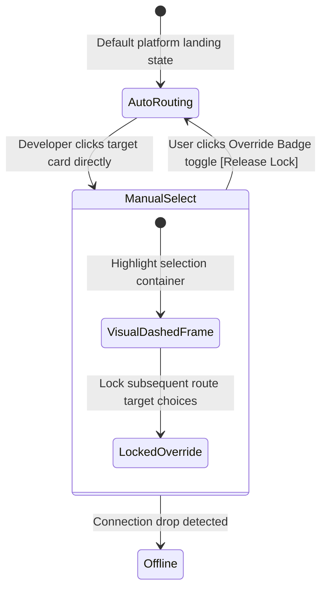

# UI/UX Architecture Specification v1.2

**Project Target:** TERA (Token-Efficient Routing Agent)  
**Deployment Target:** AMD Developer Hackathon Act II — Track 1  
**Status:** Ratified Production Blueprint  

---

## 1. Product Vision
The TERA (Token-Efficient Routing Agent) platform user interface is a high-performance developer telemetry console. It is engineered to reveal the dynamic execution patterns of an intelligent machine learning routing layer that distributes workloads between local AMD-hosted language models and premium cloud endpoints (Fireworks AI).

### 5-Second Judge Comprehension Mandate
The interface MUST enable a hackathon judge to instantly verify five critical operational values within five seconds of loading the platform:
* **Input Ingestion Origin:** What prompt data is entering the platform.
* **Selected Routing Target:** Which specific downstream model is actively executing inference.
* **Causal Justification ("Why"):** The plain-language algorithmic reason for the choice.
* **Compounding Financial ROI:** The exact dollar amount saved by avoiding high-cost API nodes.
* **Performance Integrity:** Live verification that token throughput rates and structural output safety remain uncompromised.

---

## 2. Design Principles
Every view, component state, and layout shift across the TERA platform MUST strictly conform to these ten core architectural principles:
* **Information First:** Data dictate the layout structure. Visual style organizes and clarifies information hierarchy; decorative elements are strictly prohibited.
* **Motion Supports Meaning:** Fluid state transitions are restricted to functional operations (e.g., revealing hidden metrics or showing data stream updates).
* **No Decorative UI:** Background patterns, unmapped lines, abstract gradients, and floating shadows are banned. Every pixel maps directly to system property data.
* **Zero Cognitive Overhead:** High-level metric overviews are presented prominently on the main canvas, while dense statistics are deferred to drawers.
* **Progressive Disclosure:** Advanced algorithmic telemetry (feature vectors, probability scores, raw logs) is hidden by default under expandable drawers.
* **Engineering Precision:** Layout elements use hard alignments, clear borders, and monospace font readouts to create a secure, data-dense look.
* **Consistent Terminology:** Labels maintain a strict 1:1 match between frontend text elements and backend data properties.
* **State Determinism:** Every component explicitly maps its current lifecycle phase to a corresponding visual state.
* **Color-Independent Signaling:** Structural alerts and status indicators pair color shifts with distinct text flags and geometric icons.
* **Performance-Aligned Rendering:** All graphs, streaming grids, and counters execute with minimal layout shifts to allow stable visual scanning.

---

## 3. Design Language

### A. Extended shadcn/ui HSL CSS Variables
All theme parameters are declared as raw, space-separated HSL vectors within the global CSS theme layer:

```css
@theme {
  /* Canvas Fundamentals */
  --background: 0 0% 2%;                /* #050505 - Obsidian Base */
  --foreground: 0 0% 98%;               /* #FAFAFA - Primary High-Contrast Text */

  /* Inset Containers */
  --card: 0 0% 4%;                      /* #0A0A0A - Base Card Panel */
  --card-foreground: 0 0% 98%;
  --popover: 0 0% 5%;                   /* #0D0D0D - Overlays/Dropdown Blocks */
  --popover-foreground: 0 0% 98%;

  /* Action Controls */
  --primary: 0 0% 98%;                  /* Core Interaction Controls */
  --primary-foreground: 240 5.9% 10%;
  --secondary: 240 3.7% 15.9%;          /* #242427 - Inactive Elements */
  --secondary-foreground: 0 0% 98%;
  --muted: 240 3.7% 12%;                /* #1F1F23 - Muted Background Inset */
  --muted-foreground: 240 5% 65%;       /* #A1A1AA - Neutral Subtext */

  /* Accent Signifiers */
  --accent: 0 72.2% 50.6%;              /* #DC2626 - Crimson Primary Selection */
  --accent-foreground: 0 0% 100%;
  --destructive: 0 84.2% 60.2%;         /* #EF4444 - Destructive Action */
  --destructive-foreground: 0 0% 98%;

  /* Component Frames */
  --border: 240 5.9% 15.3%;             /* #27272A - Zinc Component Border */
  --input: 240 5.9% 15.3%;
  --ring: 0 72.2% 50.6%;                /* Focus ring matching Crimson Accent */

  /* Navigation Sidebar Spec */
  --sidebar-background: 0 0% 3%;        /* #080808 - Anchor Navigation Inset */
  --sidebar-foreground: 240 5% 85%;
  --sidebar-primary: 0 72.2% 50.6%;
  --sidebar-primary-foreground: 0 0% 100%;
  --sidebar-accent: 240 3.7% 12%;
  --sidebar-accent-foreground: 0 0% 98%;
  --sidebar-border: 240 5.9% 12%;

  /* Status Colors */
  --success: 142.1 76.2% 36.3%;         /* #16A34A - Emerald Target Validation */
  --success-foreground: 0 0% 100%;
  --warning: 37.9 92.1% 50.2%;          /* #F59E0B - Amber System Fallback */
  --warning-foreground: 0 0% 0%;

  /* Recharts Visualization Scale */
  --chart-1: 0 72.2% 50.6%;             /* Crimson - Local AMD Output path */
  --chart-2: 240 5% 65%;                /* Zinc - Baseline cost profiles */
  --chart-3: 142.1 76.2% 36.3%;         /* Emerald - Target Savings threshold */
  --chart-4: 37.9 92.1% 50.2%;          /* Amber - Router overhead latency */
  --chart-5: 200 80% 50%;               /* Blue - Alternative model allocation */

  /* Shared Geometry */
  --radius: 0.375rem;                   /* 6px border radius baseline */
}
```

### B. Typography Specification Matrix
The platform uses system-level sans-serif and monospace typography configurations.

| Typographic Token | Font Stack | Weight | Font Size | Line Height | Tracking | Usage Scope |
| :--- | :--- | :--- | :--- | :--- | :--- | :--- |
| **h1-display** | font-sans | font-bold | 2.25rem (36px) | 2.5rem | tracking-tight | Total Session Savings Counter |
| **h2-section** | font-sans | font-semibold | 1.5rem (24px) | 2.0rem | tracking-tight | Main Panel & Screen Headings |
| **body-ui** | font-sans | font-normal | 0.875rem (14px) | 1.25rem | tracking-normal | Input Labels and Descriptions |
| **data-mono** | font-mono | font-medium | 0.875rem (14px) | 1.25rem | tracking-normal | Live Stream Telemetry Readouts |
| **log-stream** | font-mono | font-normal | 0.75rem (12px) | 1.0rem | tracking-normal | Developer Console Traces |

---

## 4. Visual Layout Specification

To prevent layout shifts (CLS), the interface adheres to a rigid grid framework mapping specific heights, margins, and hierarchy constraints.

### A. App Viewport Framework (Master Grid)
* **Header Height:** Fixed `h-14` (56px) with a bottom border `border-b border-border`.
* **Sidebar Width:** Fixed `w-60` (240px) with a right border `border-r border-border`.
* **Main Canvas Container:** `h-[calc(100vh-56px)]` and `w-[calc(100vw-240px)]`.
* **Outer Margins:** Zero offsets (`m-0`). Inner padding is set to a constant `p-6` (24px).
* **Inner Spacing Gutter:** All panel gaps map directly to Tailwind `gap-6` (24px).

### B. Dashboard View Grid Layout
The Live Inference Dashboard splits the workspace canvas into two main columns using a 12-column grid system (`grid grid-cols-12 gap-6 h-full items-start`):
* **Left Column (Inference Controls & Candidates):** Spans 7 columns (`col-span-7 flex flex-col gap-6`).
* **Right Column (Decision rationale & logs):** Spans 5 columns (`col-span-5 flex flex-col gap-6`).

#### Card Hierarchy (Z-Index and Layering)
1. **Header Toolbar Layer:** Fixed policy selectors and savings counter anchored at the top of the canvas layout.
2. **Action Layer:** Ingestion terminal with prompt presets and submission controls.
3. **Outcome Layer:** Routing target card that dynamically shifts focus states, highlighting downstream options.
4. **Disclosure Drawer Layer (Z-10):** Expandable bottom trace logs that slide up to overlay lower canvas quadrants.

### C. Performance Benchmark Studio Grid Layout
Divided into a balanced 2x2 grid layout system for high-contrast data visualization:
* **Grid Classes:** `grid grid-cols-2 grid-rows-2 gap-6 h-full`.
* **Quadrant Mapping:**
  * **Top-Left (ROI Trend):** Recharts Area Chart displaying accumulated savings.
  * **Top-Right (Latency Comparison):** Recharts Bar Chart showing provider latency profiles.
  * **Bottom-Left (Allocation Split):** Recharts Pie/Ring Chart displaying target selections.
  * **Bottom-Right (Dataset Performance Grid):** Dense tabular dataset accuracy summary.

### D. Transaction Ledger Grid Layout
Designed as an equal, two-column split-pane container:
* **Grid Classes:** `flex flex-row gap-6 h-full overflow-hidden`.
* **Left Half (Table Feed):** Width `w-1/2` with fixed header rows and virtualized scroll boundaries to prevent container expanding.
* **Right Half (Trace Inspector):** Width `w-1/2` mapping static JSON payload fields.

---

## 5. Responsive Behavior Matrix

| Breakpoint / Mode | Sidebar Width | Content Layout | Graphic/Chart Sizing | Minimum Height Strategy |
| :--- | :--- | :--- | :--- | :--- |
| **1366 × 768** | 200px (Compact) | Split ratio 8:4 (dense) | Recharts height locked to 180px | Custom scroll bars on workspace cards, panel padding drops to 16px (`p-4`). |
| **1600 × 900** | 240px | Split ratio 7:5 | Recharts height scales to 240px | Standard padding layout. Inner widgets display compact telemetry headers. |
| **1920 × 1080** | 240px | Split ratio 7:5 (standard) | Recharts height scales to 320px | Zero vertical scroll; fits perfectly on full HD judge presenter screens. |
| **Ultrawide (2K+)** | 240px | Centered max-w-[1920px] canvas | Recharts height locked to 400px | Margins auto-grow horizontally; borders flank the workspace area. |
| **Browser Zoom (125%)** | 200px (Compact) | Forces single column flex if width drops <1100px | Charts dynamically shrink width via `<ResponsiveContainer>` | Text scales using relative rem metrics. Elements wrap logically. |

---

## 6. Component Composition Rules

All platform features are built using recursive composition of atomic shadcn/ui components.

### 1. Prompt Ingestion Terminal
```
PromptIngestionTerminal (Custom Card)
 ├── Card (shadcn/ui Card Container)
 │    ├── CardHeader
 │    │    └── CardTitle + CardDescription
 │    ├── CardContent
 │    │    ├── Textarea (shadcn/ui Textarea Input) [aria-label="Prompt text input zone"]
 │    │    └── Inline Presets Array (Flex Container)
 │    │         └── Badge (shadcn/ui Badge Buttons) [role="button"]
 │    └── CardFooter (Horizontal Flex Container)
 │         ├── Character Counter (Muted monospaced text)
 │         └── Button (shadcn/ui Primary Button) [type="submit"]
 └── Tooltip (shadcn/ui Tooltip Controller) [fallback hints on action hover]
```

### 2. Target Model Card
```
TargetModelCard (Custom Telemetry Block)
 ├── Card (shadcn/ui Card Container with dynamic border-accent focus)
 │    ├── CardHeader (Split justify alignment)
 │    │    ├── Model Identifier Title
 │    │    └── Badge (shadcn/ui Badge indicating Active status or Fallback)
 │    └── CardContent (Grid telemetry readout)
 │         ├── Progress (shadcn/ui Progress bar tracking latency limits)
 │         ├── Separator (shadcn/ui Separator dividing structural lines)
 │         └── Metric Fields (Monospaced data indicators)
 └── Tooltip (shadcn/ui Tooltip explaining model latency/cost features)
```

### 3. Savings Counter
```
SavingsCounter (Animated Telemetry Header Widget)
 ├── Card (Borderless inline variant or Header Inset)
 │    └── CardContent (Flex row spacing items)
 │         ├── Metric Label
 │         ├── Animated Number Display (High-contrast typography)
 │         └── Tooltip (shadcn/ui Tooltip documenting calculation parameters)
```

### 4. Policy Badge
```
PolicyBadge (Policy Configuration Radio Group)
 ├── ToggleGroup (shadcn/ui ToggleGroup layout containing items)
 │    ├── ToggleGroupItem [role="radio" value="cost"]
 │    ├── ToggleGroupItem [role="radio" value="latency"]
 │    └── ToggleGroupItem [role="radio" value="quality"]
 └── Tooltip (shadcn/ui Tooltip mapping policy priority coefficients)
```

### 5. Status Indicator
```
StatusIndicator (Infrastructure Live Ping)
 ├── Badge (shadcn/ui Badge container)
 │    ├── Dynamic Dot Indicator (Green pulse, steady gray circle, orange triangle, etc.)
 │    └── Message Text
 └── Tooltip (Details about specific node address bounds and polling latency)
```

### 6. Visual Comparison Meter
```
VisualComparisonMeter (Side-by-side cost breakdown)
 ├── Card
 │    ├── CardContent
 │    │    ├── Actual vs Baseline Metric Counters
 │    │    └── Stacked Progress (Custom multi-value Progress Bar)
 │    └── Tooltip (Explains actual cost ratio relative to baseline cloud costs)
```

### 7. Progressive Disclosure Drawer
```
ProgressiveDisclosureDrawer (Bottom Slide-out Drawer)
 ├── Collapsible (shadcn/ui Collapsible container)
 │    ├── CollapsibleTrigger (Header button toggle with custom chevron)
 │    └── CollapsibleContent (Smooth height drawer area)
 │         └── ScrollArea (shadcn/ui ScrollArea containment mapping dense charts)
```

### 8. Summary Data Grid
```
SummaryDataGrid (Performance Table)
 ├── Card
 │    └── Table (shadcn/ui Table Primitives)
 │         ├── TableHeader
 │         │    └── TableRow -> TableHead Array
 │         └── TableBody
 │              ├── TableRow (Active selection highlights)
 │              │    └── TableCell (Dataset details / Accuracy data)
 │              └── TableRow (Loading Skeleton rows)
 │                   └── TableCell -> Skeleton (shadcn/ui Skeleton placeholder)
```

### 9. Streaming Table
```
StreamingTable (Ledger History Grid)
 ├── ScrollArea (shadcn/ui ScrollArea enclosing the grid container)
 │    └── Table (shadcn/ui Table Primitives mapped to virtualized react-table engine)
 │         ├── TableHeader (Fixed positioning layout)
 │         └── TableBody (Zero padding rows)
 │              └── TableRow (Incoming CSS slide-down animations)
 │                   └── TableCell -> Badge / Status Indicator mapping
```

### 10. Atomic Field Inspector
```
AtomicFieldInspector (Detail inspection tabs)
 ├── Card (Fixed height block on the right half container)
 │    ├── Tabs (shadcn/ui Tabs selector)
 │    │    ├── TabsList (Tab triggers header bar)
 │    │    │    ├── TabsTrigger [value="prompt"]
 │    │    │    ├── TabsTrigger [value="response"]
 │    │    │    └── TabsTrigger [value="trace"]
 │    │    ├── TabsContent (Standard Codeblock displays inside viewport)
 │    │    │    └── Codeblock Viewer (Scrollable text window)
 │    │    └── CardFooter (Actions toolbar)
 │    │         └── Button (shadcn/ui Button trigger for Copy to Clipboard actions)
 └── Tooltip (Validates schema format confirmation badges)
```

---

## 8. Interaction State Diagrams

To ensure absolute runtime determinism, the following state transition machines govern all composite layouts:

### A. Ingestion Routing Engine Lifecycle
Controls the manual execution pipeline from prompt entry to streaming outputs and validation confirmations.

```mermaid
stateDiagram-v2
    [*] --> Idle : System Initialized
    
    Idle --> Running : User triggers Submit / ACTIVATE_ROUTING
    Idle --> Loading : Preset query selected (Fetching asset details)
    Loading --> Idle : Preset loaded successfully
    
    Running --> Streaming : Route calculated; selected model responds
    Running --> Fallback : Gateway timeout or local node failure (Amber warning)
    
    Streaming --> Completed : Safe schema output resolved & savings accrued
    Streaming --> ValidationFailed : Syntax/format check fail (Crimson alert)
    
    Completed --> Idle : Clear / Reset terminal
    Fallback --> Completed : Backup node returns safe response
    ValidationFailed --> Idle : Clear terminal
```



### B. Host Network Connection Monitor
Monitors connection state, disabling interactive inputs during outages.

```mermaid
stateDiagram-v2
    [*] --> Online : Gateway Ping Active
    
    Online --> Offline : Connection drop detected (PING_FAILED)
    
    state Offline {
        [*] --> BannerOverlayed : Crimson alert bar displayed
        BannerOverlayed --> FieldsDisabled : UI buttons & forms set to disabled=true
        FieldsDisabled --> BackgroundPolling : Start background interval checks
    }
    
    Offline --> Online : Gateway recovery confirmed (PING_SUCCESS)
    note on entry : Dismiss banner overlay, set disabled=false
```

### C. Manual Model Override State Machine
Allows developers to override automated machine learning routing targets.



---

## 9. Screen-Specific Empty, Error, and Loading States

Components must never display empty voids or raw network failures. They must map their specific state configurations to visual layouts.

### A. Live Inference Dashboard

#### 1. Empty State (No Prompt Run Yet)
* **Ingestion Terminal:** Textarea shows: `Enter prompt tokens to analyze or select one of the core testing evaluation presets...`
* **Infrastructure Pipeline:** Display Candidate Tier Cards with a status flag of `idle` and muted zinc outlines.
* **Explanation Node:** Displays an empty slate placeholder: `Awaiting execution run to analyze features...`

#### 2. Loading State (Analysis In Progress)
* **Savings Counter:** Spins a small loader next to the telemetry digits.
* **Explanation Node:** Replaced by three pulsing gray block lines (`animate-pulse`).
* **Candidate Model Cards:** Replaced by shimmering block overlays (`Skeleton`).

#### 3. Error State (Upstream Gateway Refused)
* **Ingestion Terminal:** Focus border shifts to a dark gray outline with an error flag.
* **Target Model Card:** Remote model card border transitions to dark gray with a status badge reading `offline`.
* **Explanation Node:** Renders a callout element: `Failed to route request. API gateway returned code 503. Initializing local backup node execution...` (Status: Amber alert triangle).

---

### B. Performance Benchmark Studio

#### 1. Empty State (No Dataset Target Loaded)
* **Analytics Panel Grid:** Shows centered indicators: `Select target dataset run from header filters to generate calibration trajectory.`
* **Savings Trajectory Chart:** Renders axis grids with no data line.

#### 2. Loading State (Data Sync Running)
* **Analytics Panel Grid:** Charts display gray shimmer gradients across coordinate structures.
* **Status Badge:** Displays `processing` with a continuously rotating SVG loader.

#### 3. Error State (Log Parsing Failed)
* **Summary Grid:** Displays inline error callout: `Failed to parse local JSON log traces. Log structure is corrupted.`

---

### C. Transaction Ledger Auditor

#### 1. Empty State (No Ledger Items Cached)
* **Table View:** Shows standard empty row layout containing the single cell: `No historical telemetry traces logged for this session.`
* **Inspector Pane:** Displays: `Select a ledger transaction row from the history grid to inspect raw JSON parameters.`

#### 2. Loading State (Infinite Scroll Fetching)
* **Table View:** Appends five skeleton row layouts (`animate-pulse`) at the bottom track.

#### 3. Error State (Item Fetch Failed)
* **Inspector Pane:** Renders a warning message block: `Unable to pull detailed transaction traces from the log stream. Click 'Retry' to reload logs.`

---

## 10. Chart Conventions (Recharts Engine Implementation)

To ensure consistency in the Performance Benchmark Studio, all charts must adhere to these unified style guidelines.

```
+-----------------------------------------------------------------------+
| CHART COORDINATES SPECIFICATION SYSTEM                                |
+-----------------------------------------------------------------------+
|  Y-Axis (Number/Currency)                                             |
|   |  * Line 1 (hsl(--chart-1)) -> Local Route Allocation              |
|   |  * Line 2 (hsl(--chart-2)) -> Baseline Cost Trajectory            |
|   |                                                                   |
|   +-------------------------------------------------- X-Axis (Date)   |
|   Legend: [■ AMD Instinct Node]  [■ Premium Cloud Endpoint]           |
+-----------------------------------------------------------------------+
```

### A. Color & Legend Map
* **AMD Instinct Route Target:** Line/Bar uses `hsl(--chart-1)` (Crimson).
* **Baseline Cost Target:** Line/Bar uses `hsl(--chart-2)` (Zinc).
* **ROI Target Savings Line:** Line/Bar uses `hsl(--chart-3)` (Emerald).
* **Placement:** Legends must be placed at the bottom center of the chart area with a uniform gap of 16px (`gap-4`). Font tokens must be set to `log-stream` (Geist Mono, 12px, tracking-normal).

### B. Axis Formatting Rules
* **Grid lines:** Renders thin horizontal lines only (`StrokeWidth: 1px`, color coordinates: `hsl(--border)`). Vertical grids are disabled.
* **Ticks:** Text styled with `data-mono` (Geist Mono, 12px), colored in `hsl(--muted-foreground)`.
* **X-Axis:** Date or time labels formatted dynamically (e.g., `HH:mm:ss` for live feeds, `MMM DD` for historical aggregates).
* **Y-Axis:** Left-aligned. Values must be formatted to show standard SI suffixes (e.g., $1.2K, 3.4M tokens).

### C. Custom Interactive Tooltip
* **Style:** Rendered as a rectangular box with solid borders. Background color set to `hsl(--popover)`, borders to `hsl(--border)` (1px solid), rounded by `var(--radius)` (6px).
* **Layout:** Displays target node names, cost values, latency outputs, and timestamps in a monospaced layout.
* **Trigger:** Activates instantly on cursor intersection with coordinate bounds ($100\text{ms}$ transition ease-out timing).

### D. Formatting Standards
* **Financial Values:** Formatted to show exact dollar parameters (e.g., `$0.00015` or `$1,429.38`).
* **Time Tracking Metrics:** Rendered in milliseconds with trailing units (e.g., `18ms`).
* **Throughput Metrics:** Formatted to show tokens per second (e.g., `124 t/s`).

---

## 11. Implementation Guidelines

### A. Vite React + TypeScript Folder Organization Tree Layout
```
src/
├── components/          # Reusable UI components (PromptInput, OutputPanel, etc.)
├── pages/               # Page views (Home / Dashboard, Benchmark, Ledger)
├── App.tsx              # Application layout and routing
├── main.tsx             # Entrypoint
└── index.css            # Styling and CSS theme variables
```
