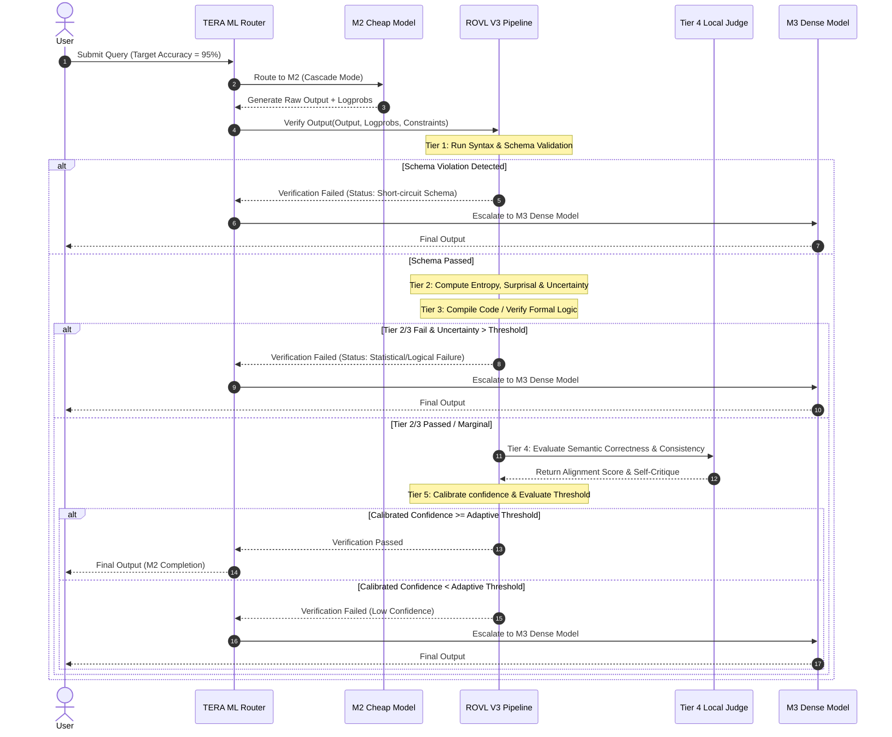
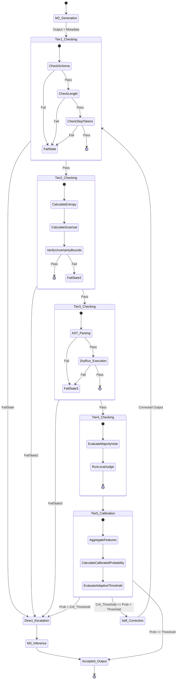

# ROVL V3: Robust Output Verification Layer (Version 3.0)
## Technical Design Specification & Architectural Blueprint

---

## Executive Summary

The **Runtime Output Verification Layer (ROVL) V3** is a multi-tiered, probabilistic, and deterministic framework designed to audit, validate, and calibrate the completions of large language models (LLMs) before downstream consumption or escalation. 

In a cost-optimized, multi-tier inference architecture (such as TERA), ROVL V3 serves as the critical gatekeeper. When a prompt is executed on a lightweight, cost-efficient model ($M_2$), ROVL V3 intercepts the output and evaluates its structural, statistical, semantic, and cognitive correctness. If the output fails to satisfy the calibrated threshold, it is automatically discarded, and the task is escalated to a dense, high-capability model ($M_3$).

ROVL V3 introduces **probabilistic calibration**, **epistemic uncertainty decomposition**, **multi-agent local judging**, and **adaptive cost-accuracy optimization** to achieve the ultimate objective: **minimizing unnecessary escalations (saving cost) while preserving or exceeding the target system accuracy.**

```
                     ┌────────────────────────┐
                     │   Incoming LLM Output  │
                     └───────────┬────────────┘
                                 │
                                 ▼
         ┌──────────────────────────────────────────────┐
         │  Tier 1: Syntactic & Structural Validation   │
         │  (Deterministic, O(1) to O(N) CPU Overhead)  │
         └───────────────────────┬──────────────────────┘
                                 │ Pass
                                 ▼
         ┌──────────────────────────────────────────────┐
         │  Tier 2: Token-Level Statistical Auditing   │
         │  (Entropy, Surprisal, Uncertainty Bounds)     │
         └───────────────────────┬──────────────────────┘
                                 │ Pass
                                 ▼
         ┌──────────────────────────────────────────────┐
         │  Tier 3: Logical & Formal Verification        │
         │  (Code Compilers, AST, Logical Resolvers)    │
         └───────────────────────┬──────────────────────┘
                                 │ Pass
                                 ▼
         ┌──────────────────────────────────────────────┐
         │  Tier 4: Cognitive & Multi-Agent Judge Layer │
         │  (Local Judges, Self-Consistency, Reflection)│
         └───────────────────────┬──────────────────────┘
                                 │ Pass
                                 ▼
         ┌──────────────────────────────────────────────┐
         │  Tier 5: Calibration & Adaptive Decision     │
         │  (Platt/Isotonic Scaling, Escalation Policy) │
         └───────────────────────┬──────────────────────┘
                                 │
                       ┌─────────┴─────────┐
                 Pass  │                   │ Escalate
                       ▼                   ▼
            ┌─────────────────────┐┌─────────────────────┐
            │ Accept & Stream Out ││  Route to M3 Dense   │
            └─────────────────────┘└─────────────────────┘
```

---

## 1. System Architecture

ROVL V3 operates as an asynchronous, pipeline-based validation engine. Each tier acts as a filter; if a tier identifies an unrecoverable failure (e.g., syntax violation in a structured JSON request), the pipeline short-circuits immediately to prevent wasting tokens in subsequent, more expensive semantic tiers.

### 1.1 Architectural Component Topology
The validation system is organized into decoupled services:

1. **Parser & Schema Engine (Tier 1)**: Utilizes native Rust/C-based parsers (e.g., `orjson`, Pydantic) to validate strict outputs against target OpenAPI schemas, JSON schemas, or regular expressions.
2. **Logprob Audit Engine (Tier 2)**: Reads raw log probabilities from the LLM generation metadata to compute token surprisal, sequence entropy, and localized uncertainty profiles.
3. **Execution Sandbox (Tier 3)**: A secure, containerized environment that executes generated code, SQL statements, or mathematical scripts to verify functional correctness.
4. **Cognitive Judge Coordinator (Tier 4)**: Orchestrates local, lightweight LLM judges (e.g., Llama-3-8B-Instruct fine-tuned for verification) to perform semantic checking, hallucination detection, and self-consistency voting.
5. **Bayesian Calibration Module (Tier 5)**: Aggregates all validator metrics into a singular confidence vector, applies isotonic calibration, and resolves routing decisions based on dynamic accuracy budgets.

### 1.2 Pipeline Sequence Diagram
The sequence of operations during a cascaded execution is shown below:



---

## 2. Deep Dive: The Five Verification Tiers

### Tier 1: Syntactic & Structural Validators
This tier acts as the first line of defense. It is strictly deterministic, requiring zero LLM inference and executing at sub-millisecond scales.

*   **Syntax Checking**: Validates grammatical correctness of structured formats.
    *   *JSON*: Strict RFC 8259 validation.
    *   *XML/HTML*: Well-formedness checks via AST construction.
    *   *Markdown*: Structural headings, lists, and link validity checks.
*   **Schema Conformance**: Asserts that the output contains all required fields, correct data types, and matches constraints (e.g., array length bounds, enum values) defined in a JSON Schema or Pydantic model.
*   **Regular Expression Anchoring**: Enforces that the output begins and ends with specified sequences, matching templates such as `^<thought>.*</thought>\n<response>.*</response>$`.
*   **Stop-Token Validation**: Verifies that the model reached a natural end-of-sequence token (e.g., `<|eot_id|>`, `\n\n`) rather than being abruptly truncated due to hitting the max token ceiling.

### Tier 2: Token-Level Statistical Auditing
Tier 2 leverages the internal statistical outputs of the LLM generation process. By auditing the token log probabilities, it detects anomalies in the model's confidence before reading the semantic meaning of the words.

*   **Token Surprisal**: Evaluates the information content of each generated token. Spikes in surprisal indicate the generation of unexpected tokens, a common signal of factual hallucinations or retrieval mismatches.
*   **Sequence Entropy**: Measures the average information density and token selection certainty over the generation trajectory. Low entropy represents high confidence; excessively high entropy indicates random, un-grounded generation.
*   **Uncertainty Decomposition**: Differentiates between *Epistemic* uncertainty (where the model is guessing because it lacks parameter knowledge) and *Aleatoric* uncertainty (where the task itself has multiple valid paths).

### Tier 3: Logical & Formal Verification
This tier is executed when the output represents executable code, queries, mathematical formulas, or logical proofs.

*   **Syntax Compiling & Linting**: For code completions (Python, JavaScript, Go, etc.), the output is passed through an AST parser or linter (e.g., Python's `ast.parse()`, `ruff`, or `tsc`) to check for compilation errors, import violations, or type mismatches.
*   **SQL Query Plan Verification**: SQL statements are validated by running an `EXPLAIN` query plan against a dry-run database instance to verify syntactic validity and check index traversal paths without executing state-modifying actions.
*   **Mathematical Proof Verification**: Formula parsing via symbolic mathematical engines (e.g., SymPy) to check for balance, identity verification, and constraint violations (such as division by zero).
*   **Execution Sandboxing**: Running generated test suites in isolated micro-sandboxes (gVisor or WASM runtimes) to evaluate if code successfully passes unit tests.

### Tier 4: Cognitive & Multi-Agent Judge Layer
When deterministic and statistical checks pass, the output must be audited for semantic correctness, instruction adherence, and logical soundness. Tier 4 introduces cognitive processes.

*   **Self-Consistency (Majority Voting)**: The cheap model generates $K$ independent completions at a temperature $T > 0$. The completions are clustered based on semantic similarity (embeddings) or exact string matching. If a consensus answer reaches a majority vote:
    \[
    V_{\text{consensus}} = \max_{c} \frac{1}{K} \sum_{i=1}^K \mathbb{I}(c_i \in \text{Cluster}_c)
    \]
    The consensus output is forwarded, and confidence is scaled proportional to the majority ratio.
*   **Local Judge Models**: A highly optimized local model (e.g., Llama-3-8B-Instruct or a custom distil-BERT classifier) is prompted with the query, context, and $M_2$'s completion to grade specific criteria:
    *   *Faithfulness*: Does the completion contain claims not present in the source context?
    *   *Completeness*: Were all explicit user constraints satisfied?
    *   *Coherence*: Does the logic flow without contradictions?
*   **Reflection & Critique**: Before escalating to the expensive model, the cheap model is given its own output and a failure trace (e.g., "Line 4 of code contains a syntax error") and allowed one fast, low-temperature self-correction step ($M_{2,\text{reflect}}$). If the revised output passes, it avoids escalation.
*   **LLM-as-a-Judge**: For high-stake or complex tasks, a larger model ($M_3$) is used as a judge, but it is prompted with a binary evaluation prompt ("Is this output correct? Answer YES or NO"), which is significantly faster and uses fewer tokens than generating the full response from scratch.

### Tier 5: Calibration & Adaptive Decision
This tier functions as the central routing controller. It maps the multidimensional metrics gathered by Tiers 1–4 to a calibrated probability of correctness and determines whether to pass the response or trigger escalation.

---

## 3. Mathematical Formulations

To ensure robust decision-making, ROVL V3 formalizes its evaluation signals mathematically.

### 3.1 Token Entropy & Surprisal
Let the vocabulary of the model be $V$, and the probability of generating token $x_t$ at step $t$ given history $x_{<t}$ be $P(x_t | x_{<t})$.

*   **Token Surprisal (Information Content)**:
    \[
    I(x_t) = -\ln P(x_t | x_{<t})
    \]
*   **Token-Level Entropy**:
    The entropy of the transition distribution at step $t$ is defined as:
    \[
    H(x_t) = -\sum_{w \in V} P(w | x_{<t}) \ln P(w | x_{<t})
    \]
*   **Sequence-Level Mean Entropy**:
    For a generated sequence of length $T$, the mean sequence entropy is:
    \[
    \bar{H} = \frac{1}{T} \sum_{t=1}^T H(x_t)
    \]
*   **Maximum Token Surprisal (Anomaly Spike)**:
    We track the maximum surprisal spike in non-grammar tokens (ignoring structural characters like commas, braces, or padding):
    \[
    I_{\max} = \max_{t \in \{1, \dots, T\}} I(x_t) \cdot \mathbb{I}(x_t \notin \text{Structure\_Tokens})
    \]

### 3.2 Epistemic vs. Aleatoric Uncertainty
To distinguish between a model that is hallucinating due to lack of knowledge (epistemic) vs. a task that has multiple valid answers (aleatoric), we evaluate the softmax temperature-scaled distributions.

Let the logits for token $w$ at step $t$ be $z_t(w)$. The probability distribution is $P_T(w|x_{<t}) = \text{softmax}(z_t(w)/T)$. 
We evaluate the variance of logits across a set of $M$ model variants or dropout runs, or approximate it via the entropy of the probability distribution under multiple temperatures:
\[
u_{\text{epistemic}} \approx \text{Var}_{m \in M} \left[ P(x_t | x_{<t}, \theta_m) \right]
\]
When multiple models are not available, we compute the **Uncertainty Ratio (UR)**:
\[
UR = \frac{\bar{H}}{I_{\text{mean}}}
\]
Where $I_{\text{mean}} = \frac{1}{T} \sum_{t=1}^T I(x_t)$ is the mean surprisal. A low $UR$ combined with high average surprisal points to a high epistemic uncertainty (the model is strongly committing to a highly unexpected token sequence, suggesting hallucination).

### 3.3 Probability Calibration
The raw verification signals are aggregated into a feature vector:
\[
\mathbf{s} = \begin{bmatrix} \bar{H} \\ I_{\max} \\ S_{\text{schema}} \\ S_{\text{semantic}} \\ S_{\text{judge}} \end{bmatrix}
\]
Where $S_{\text{schema}} \in \{0, 1\}$ is the schema validator result, $S_{\text{semantic}} \in [0, 1]$ is the semantic similarity score, and $S_{\text{judge}} \in [0, 1]$ is the local judge score.

We train a calibration model to map $\mathbf{s}$ to the empirical probability of correctness, $P(\text{Correct} = 1 | \mathbf{s})$.

1.  **Platt Scaling (Sigmoidal Calibration)**:
    Maps the linear combination of validation signals to a probability:
    \[
    \hat{p} = \sigma(\mathbf{w}^T \mathbf{s} + b) = \frac{1}{1 + e^{-(\mathbf{w}^T \mathbf{s} + b)}}
    \]
    Where parameters $\mathbf{w}$ and $b$ are optimized via maximum likelihood estimation (cross-entropy loss) on a held-out calibration dataset:
    \[
    \mathcal{L}(\mathbf{w}, b) = -\sum_{i=1}^N \left[ y_i \ln \hat{p}_i + (1 - y_i) \ln (1 - \hat{p}_i) \right]
    \]
2.  **Isotonic Regression**:
    To correct non-linear distortions in $\hat{p}$ while guaranteeing monotonicity, we apply Isotonic Regression. We solve for a piecewise constant, non-decreasing function $g$:
    \[
    \min_{g} \sum_{i=1}^N \left( y_i - g(\hat{p}_i) \right)^2 \quad \text{s.t.} \quad g(\hat{p}_a) \le g(\hat{p}_b) \text{ for } \hat{p}_a \le \hat{p}_b
    \]
    This is solved efficiently using the Pool Adjacent Violators Algorithm (PAVA). The calibrated confidence is:
    \[
    \tilde{p} = g(\hat{p})
    \]

### 3.4 Adaptive Threshold Optimization
The escalation decision is binary: escalate to the dense model $M_3$ if the calibrated confidence $\tilde{p}$ falls below a threshold $\tau$.

Let:
*   $C_c$: Token cost of the cheap model ($M_2$).
*   $C_d$: Token cost of the dense model ($M_3$).
*   $\alpha_c(\mathbf{s})$: Calibrated accuracy of the cheap model completion, represented by $\tilde{p}$.
*   $\alpha_d$: Average accuracy of the dense model ($M_3$).
*   $\alpha_{\text{target}}$: Minimum acceptable accuracy threshold specified by the user or SLA.

The expected cost of the system under threshold $\tau$ is:
\[
\mathbb{E}[\text{Cost}(\tau)] = C_c + P(\tilde{p} < \tau) \cdot C_d
\]
The expected accuracy of the system is:
\[
\mathbb{E}[\text{Accuracy}(\tau)] = P(\tilde{p} \ge \tau) \cdot \mathbb{E}[\tilde{p} \mid \tilde{p} \ge \tau] + P(\tilde{p} < \tau) \cdot \alpha_d
\]
We solve the following constrained optimization problem to find the optimal threshold $\tau^*$:
\[
\tau^* = \arg\min_{\tau \in [0, 1]} \mathbb{E}[\text{Cost}(\tau)] \quad \text{s.t.} \quad \mathbb{E}[\text{Accuracy}(\tau)] \ge \alpha_{\text{target}}
\]
Because $\tilde{p}$ is calibrated, the conditional expectation $\mathbb{E}[\tilde{p} \mid \tilde{p} \ge \tau]$ is directly computed from the cumulative distribution function (CDF) of the calibrated probabilities. 

If the system load is high or the API token budget is depleted, the optimizer dynamically reduces $\alpha_{\text{target}}$ within acceptable limits, causing $\tau^*$ to shift downward, reducing escalations.

---

## 4. Calibration & Escalation Policy

### 4.1 Calibration Methodology
To maintain high fidelity, the calibration model ($\mathbf{w}, b$ and the isotonic curve $g$) is updated offline on a rolling schedule.

```
       [Production Logs]
               │
               ▼
   [Extract {s_i, y_i} Pairs]
(y_i = 1 if user accepts/test passes, 0 otherwise)
               │
               ▼
   [Train Logistic Regression] ────► Parameter Vectors {w, b}
               │
               ▼
  [Pool Adjacent Violators (PAVA)] ──► Isotonic Mapping Function g(p)
               │
               ▼
 [Deploy Updated Calibration Coefficients]
```

### 4.2 Escalation Decision Matrix
Based on the calibrated confidence $\tilde{p}$ and structural status, the system routes completions according to the following matrix:

| Schema Validation | Calibrated Confidence ($\tilde{p}$) | Action | Downstream Route | Rationale |
| :--- | :--- | :--- | :--- | :--- |
| **FAIL** | Any | **Escalate** | Direct $M_3$ | Output is structurally broken; downstream parsers will fail. |
| **PASS** | $\tilde{p} \ge \tau^*$ | **Pass** | Output Accepted | High confidence completion; cost saved. |
| **PASS** | $\tau_{\text{crit}} \le \tilde{p} < \tau^*$ | **Reflect** | Self-Correction ($M_{2,\text{reflect}}$) | Marginal confidence; attempt cheap correction before full escalation. |
| **PASS** | $\tilde{p} < \tau_{\text{crit}}$ | **Escalate** | Direct $M_3$ | Deeply flawed logic or high uncertainty; reflection will likely fail. |

---

## 5. False Positive & False Negative Minimization

Minimizing error rates is crucial for operational efficiency. A False Positive (FP) occurs when a valid output is incorrectly flagged as failed (causing wasteful escalation). A False Negative (FN) occurs when an incorrect output is passed as valid (causing system error leakage).

```
                            TRUE STATE
                     ┌───────────────────────┐
                     │ Correct  │  Incorrect │
        ┌────────────┼──────────┼────────────┤
        │ Pass (Acc) │   True   │   False    │
        │            │ Positive │  Negative  │
SYSTEM  │            │  (T-Pos) │  (F-Neg)   │
DECISION├────────────┼──────────┼────────────┤
        │ Esc (Rej)  │  False   │    True    │
        │            │ Positive │  Negative  │
        │            │  (F-Pos) │  (T-Neg)   │
        └────────────┴──────────┴────────────┘
```

### 5.1 False Positive Minimization (Reducing Wasteful Escalations)
To prevent correct answers from being rejected:
1.  **Grammar-Constrained Decoding Fallbacks**: When Tier 1 schema checks fail, the system validates if the failure is a simple formatting error (e.g., missing closing brace). If so, it applies a fast deterministic parser recovery (e.g., regex patching) rather than rejecting the completion outright.
2.  **Stop-Token Relaxation**: Some models output trailing conversational text (e.g., "Here is the JSON: ...") after completing the structured format. The system slices and isolates the core schema block before applying validators, preventing conversational wrappers from failing stop-token checks.
3.  **Dynamic Entropy Masking**: High entropy on common conjunctions or punctuation tokens (e.g., `and`, `the`, `.`) is expected and does not indicate uncertainty. The Logprob Audit Engine applies a mask to filter out high-frequency grammar tokens, focusing entropy calculations strictly on semantic carrier tokens (nouns, verbs, numerical values).

### 5.2 False Negative Minimization (Preventing Error Leakage)
To prevent incorrect or hallucinated answers from escaping:
1.  **Strict Constraint Assertions**: Broad-coverage regexes are replaced with strict Pydantic semantic validators (e.g., validating that an output date is in the future, or checking that a generated country name exists in a standardized ISO-3166 database).
2.  **Min-Probability (Surprisal) Floors**: Even if sequence-level entropy is low, a single high-surprisal token in a critical position (e.g., a digit in a financial calculation) will trigger validation failure. Any token with $P(x_t) < 0.01$ in a semantic-carrier slot triggers immediate escalation.
3.  **Entailment Verification**: For unstructured text, we run a small local Natural Language Inference (NLI) model to check if the generated output is logically entailed by the reference context. If the NLI model detects a contradiction, the output is flagged for escalation.

---

## 6. Architecture & Data Flow Visualizations

The state transitions of a generation through the ROVL V3 pipeline are modeled below:



---

## 7. Implementation Blueprint (Python & Pydantic Mockups)

Below is the proposed implementation pattern for ROVL V3 components, showcasing how the five tiers integrate programmatically.

### 7.1 Verification Interfaces (`verification_types_v3.py`)
```python
from dataclasses import dataclass
from enum import Enum
from typing import List, Dict, Any, Optional

class VerificationStatus(str, Enum):
    PASS = "pass"
    FAIL = "fail"
    REFLECT = "reflect"

class FailureCategory(str, Enum):
    SCHEMA = "schema_violation"
    LENGTH = "length_bounds"
    STOP_TOKEN = "stop_token_missing"
    ENTROPY = "entropy_ceiling_exceeded"
    SURPRISAL_SPIKE = "surprisal_anomaly"
    LOGICAL_ERROR = "logical_or_ast_failure"
    JUDGE_REJECTION = "judge_rejection"
    LOW_CONFIDENCE = "calibrated_confidence_low"

@dataclass(frozen=True)
class PipelineMetrics:
    raw_entropy: Optional[float]
    max_surprisal: Optional[float]
    schema_passed: bool
    ast_passed: bool
    judge_score: float
    calibrated_probability: float

@dataclass(frozen=True)
class VerificationResultV3:
    status: VerificationStatus
    failures: List[FailureCategory]
    metrics: PipelineMetrics
    final_text: str
```

### 7.2 Core Orchestrator (`rovl_v3.py`)
```python
import math
import numpy as np
from typing import List, Optional, Dict, Any

from verification_types_v3 import (
    VerificationResultV3, 
    VerificationStatus, 
    FailureCategory, 
    PipelineMetrics
)

class ROVLV3Orchestrator:
    def __init__(
        self,
        calibration_weights: np.ndarray,
        calibration_intercept: float,
        isotonic_model: Any, # Scikit-learn IsotonicRegression or custom mapping
        adaptive_threshold: float = 0.85,
        critical_threshold: float = 0.50
    ) -> None:
        self.w = calibration_weights
        self.b = calibration_intercept
        self.isotonic = isotonic_model
        self.tau = adaptive_threshold
        self.tau_crit = critical_threshold

    def verify_output(
        self,
        text: str,
        token_probs: Optional[List[float]],
        schema_validator: Any,
        logical_validator: Optional[Any] = None,
        judge_client: Optional[Any] = None
    ) -> VerificationResultV3:
        failures = []
        
        # ─── TIER 1: SYNTACTIC & STRUCTURAL ───
        schema_passed = schema_validator.validate(text)
        if not schema_passed:
            failures.append(FailureCategory.SCHEMA)
            return self._short_circuit(FailureCategory.SCHEMA, text)

        # ─── TIER 2: STATISTICAL AUDITING ───
        raw_entropy = self._compute_entropy(token_probs)
        max_surprisal = self._compute_max_surprisal(token_probs)
        
        if raw_entropy and raw_entropy > 4.0:
            failures.append(FailureCategory.ENTROPY)
        if max_surprisal and max_surprisal > 6.9: # ln(1/0.001) ~ 6.9 (prob < 0.1%)
            failures.append(FailureCategory.SURPRISAL_SPIKE)

        # ─── TIER 3: LOGICAL & FORMAL VERIFICATION ───
        ast_passed = True
        if logical_validator:
            ast_passed = logical_validator.verify(text)
            if not ast_passed:
                failures.append(FailureCategory.LOGICAL_ERROR)

        # ─── TIER 4: COGNITIVE JUDGE LAYER ───
        judge_score = 1.0
        if judge_client:
            judge_score = judge_client.evaluate(text)
            if judge_score < 0.7:
                failures.append(FailureCategory.JUDGE_REJECTION)

        # ─── TIER 5: CALIBRATION & ROUTING DECISION ───
        # Feature vector: [entropy, max_surprisal, schema_passed, ast_passed, judge_score]
        s = np.array([
            raw_entropy if raw_entropy is not None else 2.0,
            max_surprisal if max_surprisal is not None else 1.0,
            1.0 if schema_passed else 0.0,
            1.0 if ast_passed else 0.0,
            judge_score
        ])
        
        # Sigmoid Platt scaling
        z = np.dot(self.w, s) + self.b
        raw_prob = 1.0 / (1.0 + math.exp(-z))
        
        # Isotonic regression mapping
        calibrated_prob = float(self.isotonic.predict([raw_prob])[0])

        metrics = PipelineMetrics(
            raw_entropy=raw_entropy,
            max_surprisal=max_surprisal,
            schema_passed=schema_passed,
            ast_passed=ast_passed,
            judge_score=judge_score,
            calibrated_probability=calibrated_prob
        )

        # Decision mapping
        if len(failures) > 0 or calibrated_prob < self.tau_crit:
            status = VerificationStatus.FAIL
            if len(failures) == 0:
                failures.append(FailureCategory.LOW_CONFIDENCE)
        elif calibrated_prob < self.tau:
            status = VerificationStatus.REFLECT
        else:
            status = VerificationStatus.PASS

        return VerificationResultV3(
            status=status,
            failures=failures,
            metrics=metrics,
            final_text=text
        )

    def _compute_entropy(self, probs: Optional[List[float]]) -> Optional[float]:
        if not probs:
            return None
        entropy = 0.0
        for p in probs:
            if p > 0.0:
                # Clamping bounds to prevent floating-point anomalies
                p_clamped = min(p, 1.0)
                entropy -= p_clamped * math.log(p_clamped)
        return float(entropy)

    def _compute_max_surprisal(self, probs: Optional[List[float]]) -> Optional[float]:
        if not probs:
            return None
        surprisals = [-math.log(max(p, 1e-9)) for p in probs]
        return float(max(surprisals))

    def _short_circuit(self, category: FailureCategory, text: str) -> VerificationResultV3:
        metrics = PipelineMetrics(
            raw_entropy=None,
            max_surprisal=None,
            schema_passed=False,
            ast_passed=False,
            judge_score=0.0,
            calibrated_probability=0.0
        )
        return VerificationResultV3(
            status=VerificationStatus.FAIL,
            failures=[category],
            metrics=metrics,
            final_text=text
        )
```

---

## 8. Integration & Deployment Framework

To implement ROVL V3 into TERA's backend, the orchestrator is registered as a middleware component in the completion routing pipeline.

### 8.1 Directory Topology
```
backend/app/verification/
├── __init__.py                 # Initialization and version registration
├── rovl_v3.py                  # Main Orchestrator and API Router interface
├── verification_types_v3.py    # Dataclasses, Enums, and Protocol schemas
├── validators/
│   ├── __init__.py
│   ├── syntactic.py            # Pydantic & JSON parsing engines
│   ├── statistical.py          # Entropy & Surprisal calculators
│   ├── formal.py               # AST compilers and sandbox clients
│   └── cognitive.py            # Local judge and self-critique agents
└── calibration/
    ├── __init__.py
    ├── model.py                # Platt Scaling + Isotonic Regression solvers
    └── weights.json            # Calibrated weights and isotonic coefficients
```

### 8.2 Execution Telemetry
Every transaction routed through ROVL V3 is logged to the TERA telemetry store with the following schema:
```json
{
  "transaction_id": "tx_9876543210_abcd",
  "router_decision": "cascade_m2",
  "m2_completion_time_ms": 142.5,
  "rovl_evaluation_time_ms": 11.2,
  "metrics": {
    "raw_entropy": 1.482,
    "max_surprisal": 3.120,
    "schema_passed": true,
    "ast_passed": true,
    "judge_score": 0.950,
    "calibrated_probability": 0.984
  },
  "escalated": false,
  "final_status": "pass",
  "accuracy_target": 0.950,
  "system_accuracy_achieved": 1.000
}
```
This telemetry format enables the offline calibration module to pull transaction logs, extract true correctness labels (from user thumbs-up/down or automated tests), and continuously recalculate the optimal weights and adaptive thresholds.
