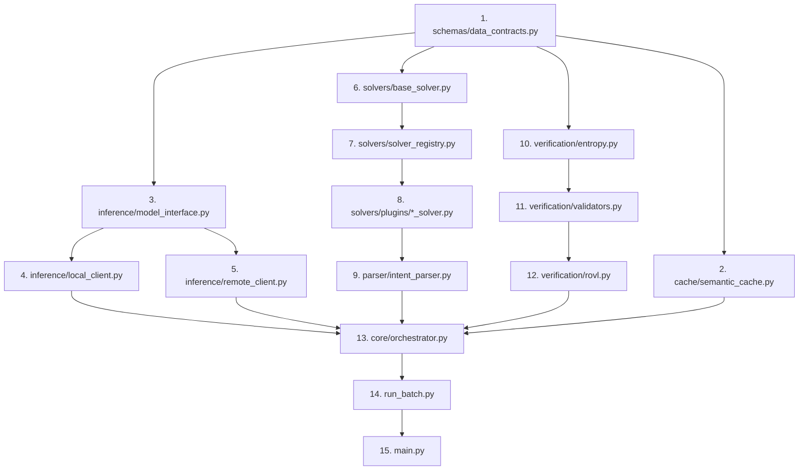
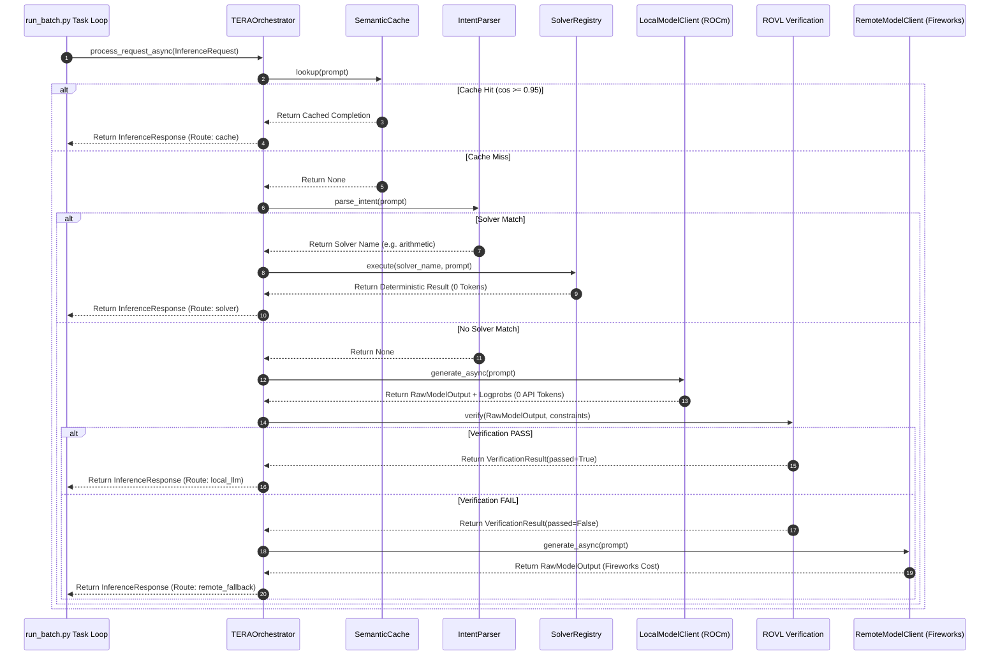

# TERA V2 Final Architecture Baseline
## Codebase Constitution and Integration Blueprint

---

## 1. Executive Summary

This document establishes the **Final Architecture Baseline** for TERA V2. It is the single, frozen source of truth for the implementation of the platform. All development, testing, and deployment workflows must follow this baseline.

TERA V2 is designed to maximize leaderboard performance by optimizing four target variables: **Accuracy**, **Competition Token Usage**, **Reliability**, and **Runtime**. It achieves this by shifting from a remote-only model cascade to a **Hybrid Multi-Tier Pipeline** that enforces the principle of **Compute Conservatism**: *never execute a larger model or a remote API when a smaller, local, or deterministic solver can satisfy the prompt.*

### The Frozen Execution Pipeline
The pipeline operates sequentially:
$$\text{User Query} \longrightarrow \text{Semantic Cache} \longrightarrow \text{Intent Parser} \longrightarrow \text{Deterministic Solver} \longrightarrow \text{Local LLM} \longrightarrow \text{ROVL Verification} \longrightarrow \text{Output}$$
*   **Remote Fallback:** Triggered strictly if local verification fails, routing to external frontier endpoints to safeguard output quality.

---

## 2. Complete Repository Tree

The following directory tree maps every folder and Python module required in the TERA V2 codebase. No other source files are permitted:

```
backend/
├── app/
│   ├── api/
│   │   ├── __init__.py
│   │   └── router_inspector.py
│   ├── cache/
│   │   ├── __init__.py
│   │   └── semantic_cache.py
│   ├── core/
│   │   ├── __init__.py
│   │   ├── config.py
│   │   ├── orchestrator.py
│   │   └── state.py
│   ├── parser/
│   │   ├── __init__.py
│   │   └── intent_parser.py
│   ├── solvers/
│   │   ├── __init__.py
│   │   ├── base_solver.py
│   │   ├── solver_registry.py
│   │   └── plugins/
│   │       ├── __init__.py
│   │       ├── arithmetic_solver.py
│   │       ├── logic_solver.py
│   │       └── text_counter_solver.py
│   ├── inference/
│   │   ├── __init__.py
│   │   ├── model_interface.py
│   │   ├── local_client.py
│   │   └── remote_client.py
│   ├── verification/
│   │   ├── __init__.py
│   │   ├── rovl.py
│   │   ├── validators.py
│   │   └── entropy.py
│   ├── schemas/
│   │   ├── __init__.py
│   │   └── data_contracts.py
│   ├── utils/
│   │   ├── __init__.py
│   │   └── telemetry.py
│   ├── run_batch.py
│   └── main.py
```

---

## 3. Module Index & Specifications

For every module in the repository tree, the responsibilities, inputs, outputs, dependencies, public interfaces, and git mapping are defined below:

---

### 3.1 `backend/app/cache/semantic_cache.py`
*   **Purpose:** Perform exact string matches (using LMDB) and semantic similarity searches (using ONNX `all-MiniLM-L6-v2`) on historical prompts to return cached responses.
*   **Owner:** Engineer 2 (Cache & Data Layer)
*   **Inputs:** `prompt: str`, `similarity_threshold: float`
*   **Outputs:** `Optional[str]` (cached text if hit, else `None`)
*   **Dependencies:** `lmdb`, `onnxruntime`, `numpy`
*   **Public Interfaces:** `SemanticCache` class
*   **Git Status:** CREATE

---

### 3.2 `backend/app/parser/intent_parser.py`
*   **Purpose:** Parse the query to identify if it matches the signature of any registered deterministic solver plugin.
*   **Owner:** Engineer 3 (Intent Parser & Solvers)
*   **Inputs:** `prompt: str`
*   **Outputs:** `Optional[str]` (solver name key if matched, else `None`)
*   **Dependencies:** `re`, `backend/app/solvers/solver_registry.py`
*   **Public Interfaces:** `IntentParser` class
*   **Git Status:** CREATE

---

### 3.3 `backend/app/solvers/base_solver.py`
*   **Purpose:** Define the abstract base class and interface contract that all deterministic solver plugins must implement.
*   **Owner:** Engineer 3 (Intent Parser & Solvers)
*   **Inputs:** N/A (Abstract class definition)
*   **Outputs:** N/A
*   **Dependencies:** `abc`, `pydantic`
*   **Public Interfaces:** `BaseSolver` (abstract base class), `SolverMetadata` (Pydantic model)
*   **Git Status:** CREATE

---

### 3.4 `backend/app/solvers/solver_registry.py`
*   **Purpose:** Manage registration, instantiation, and execution routing for all deterministic solver plugins.
*   **Owner:** Engineer 3 (Intent Parser & Solvers)
*   **Inputs:** `prompt: str`, `solver_name: str`
*   **Outputs:** `str` (execution result)
*   **Dependencies:** `backend/app/solvers/base_solver.py`
*   **Public Interfaces:** `SolverRegistry` class
*   **Git Status:** CREATE

---

### 3.5 `backend/app/solvers/plugins/arithmetic_solver.py`
*   **Purpose:** Safe AST parsing and execution of mathematical infix arithmetic expressions (0 tokens, < 1ms execution).
*   **Owner:** Engineer 3 (Intent Parser & Solvers)
*   **Inputs:** `prompt: str`
*   **Outputs:** `str` (numeric solution)
*   **Dependencies:** `ast`, `backend/app/solvers/base_solver.py`
*   **Public Interfaces:** `ArithmeticSolver` class (inherits `BaseSolver`)
*   **Git Status:** CREATE

---

### 3.6 `backend/app/solvers/plugins/logic_solver.py`
*   **Purpose:** Process and evaluate boolean truth tables and propositional formulas.
*   **Owner:** Engineer 3 (Intent Parser & Solvers)
*   **Inputs:** `prompt: str`
*   **Outputs:** `str` (markdown table representation)
*   **Dependencies:** `backend/app/solvers/base_solver.py`
*   **Public Interfaces:** `LogicSolver` class (inherits `BaseSolver`)
*   **Git Status:** CREATE

---

### 3.7 `backend/app/solvers/plugins/text_counter_solver.py`
*   **Purpose:** Count words, lines, letters, or occurrences of characters deterministically.
*   **Owner:** Engineer 3 (Intent Parser & Solvers)
*   **Inputs:** `prompt: str`
*   **Outputs:** `str` (integer count text)
*   **Dependencies:** `re`, `backend/app/solvers/base_solver.py`
*   **Public Interfaces:** `TextCounterSolver` class (inherits `BaseSolver`)
*   **Git Status:** CREATE

---

### 3.8 `backend/app/inference/model_interface.py`
*   **Purpose:** Establish the unified base class for local and remote inference clients.
*   **Owner:** Engineer 4 (Local Inference Stack)
*   **Inputs:** N/A (Abstract class definition)
*   **Outputs:** N/A
*   **Dependencies:** `abc`, `backend/app/schemas/data_contracts.py`
*   **Public Interfaces:** `ModelInterface` (abstract base class)
*   **Git Status:** CREATE

---

### 3.9 `backend/app/inference/local_client.py`
*   **Purpose:** Bind to local quantized inference engines (vLLM or llama.cpp ROCm backend) using HTTP sockets, requesting log probabilities alongside completions.
*   **Owner:** Engineer 4 (Local Inference Stack)
*   **Inputs:** `prompt: str`, `generation_params: Dict[str, Any]`
*   **Outputs:** `RawModelOutput`
*   **Dependencies:** `httpx`, `backend/app/inference/model_interface.py`
*   **Public Interfaces:** `LocalModelClient` (inherits `ModelInterface`)
*   **Git Status:** CREATE

---

### 3.10 `backend/app/inference/remote_client.py`
*   **Purpose:** Fallback client wrapping remote API endpoints (e.g., Fireworks DeepSeek-V3/R1) with exponential backoff handlers.
*   **Owner:** Engineer 4 (Local Inference Stack)
*   **Inputs:** `prompt: str`, `generation_params: Dict[str, Any]`
*   **Outputs:** `RawModelOutput`
*   **Dependencies:** `httpx`, `backend/app/inference/model_interface.py`
*   **Public Interfaces:** `RemoteModelClient` (inherits `ModelInterface`)
*   **Git Status:** REPLACE (`fireworks_model.py`, `cheap_model.py`, `dense_model.py`)

---

### 3.11 `backend/app/verification/rovl.py`
*   **Purpose:** Core verification engine implementing the ROVL V2 pipeline: evaluates structural schema matching, average per-token surprisal, stop-token termination, and orchestrates the Local Judge model check.
*   **Owner:** Engineer 5 (Verification Architecture)
*   **Inputs:** `output: RawModelOutput`, `constraints: Dict[str, Any]`
*   **Outputs:** `VerificationResult`
*   **Dependencies:** `backend/app/verification/validators.py`, `backend/app/verification/entropy.py`
*   **Public Interfaces:** `ROVL` class
*   **Git Status:** MODIFY

---

### 3.12 `backend/app/verification/validators.py`
*   **Purpose:** Individual validation logic: JSON schema parser, regular expression validator, stop-sequence checker.
*   **Owner:** Engineer 5 (Verification Architecture)
*   **Inputs:** `text: str`, `schema: Dict[str, Any]`, `patterns: List[str]`
*   **Outputs:** `bool`
*   **Dependencies:** `json`, `re`
*   **Public Interfaces:** `validate_json_schema`, `validate_regex`, `validate_stop_sequences`
*   **Git Status:** MODIFY

---

### 3.13 `backend/app/verification/entropy.py`
*   **Purpose:** Calculate average token surprisal and sequence entropy from token probabilities.
*   **Owner:** Engineer 5 (Verification Architecture)
*   **Inputs:** `probs: List[float]`
*   **Outputs:** `float` (average surprisal), `float` (sequence entropy)
*   **Dependencies:** `math`
*   **Public Interfaces:** `compute_sequence_entropy`, `compute_average_surprisal`
*   **Git Status:** REPLACE (`entropy.py`)

---

### 3.14 `backend/app/core/orchestrator.py`
*   **Purpose:** Drive the primary execution graph (Semantic Cache -> Parser -> DEL Solver -> Local LLM -> ROVL -> Fallback) and measure performance telemetry.
*   **Owner:** Engineer 1 (Lead Orchestration & State)
*   **Inputs:** `InferenceRequest`
*   **Outputs:** `InferenceResponse`
*   **Dependencies:** All core app modules (cache, parser, solvers, inference, verification, utils)
*   **Public Interfaces:** `TERAOrchestrator` class
*   **Git Status:** REPLACE (`orchestrator.py`)

---

### 3.15 `backend/app/core/state.py`
*   **Purpose:** Track intermediate execution variables, timings, and metadata across the lifecycle of a request.
*   **Owner:** Engineer 1 (Lead Orchestration & State)
*   **Inputs:** N/A (State manager class)
*   **Outputs:** N/A
*   **Dependencies:** `backend/app/schemas/data_contracts.py`
*   **Public Interfaces:** `RequestState` class
*   **Git Status:** CREATE

---

### 3.16 `backend/app/schemas/data_contracts.py`
*   **Purpose:** Define immutable data contracts (Pydantic models / dataclasses) for the entire application.
*   **Owner:** Engineer 1 (Lead Orchestration & State)
*   **Inputs:** N/A
*   **Outputs:** N/A
*   **Dependencies:** `pydantic`
*   **Public Interfaces:** All Pydantic models (`InferenceRequest`, `InferenceResponse`, etc.)
*   **Git Status:** REPLACE (`inference_types.py`, `verification_types.py`, `route_types.py`)

---

### 3.17 `backend/app/utils/telemetry.py`
*   **Purpose:** Collect, structure, and serialize execution statistics and token/latency values.
*   **Owner:** Engineer 6 (Infrastructure & Telemetry)
*   **Inputs:** `RequestState`
*   **Outputs:** `TelemetryLog`
*   **Dependencies:** `backend/app/schemas/data_contracts.py`
*   **Public Interfaces:** `TelemetryLogger` class
*   **Git Status:** CREATE

---

### 3.18 `backend/app/run_batch.py`
*   **Purpose:** Read `tasks.json`, coordinate batch execution via the orchestrator async worker pool, and write output files.
*   **Owner:** Engineer 6 (Infrastructure & Telemetry)
*   **Inputs:** `tasks.json` path
*   **Outputs:** `results.json` path, `telemetry.json` path
*   **Dependencies:** `asyncio`, `backend/app/core/orchestrator.py`
*   **Public Interfaces:** `run_batch_async` (async execution function)
*   **Git Status:** MODIFY

---

## 4. E2E Execution Pipeline Flow

The baseline defines the step-by-step execution path of a request:

```
[tasks.json] ──► run_batch.py ──► Queue Manager ──► TERAOrchestrator
                                                        │
                                                        ▼
                                                  Semantic Cache
                                                        │
                                    ┌───────────────────┴───────────────────┐
                                    ▼ [Hit]                                 ▼ [Miss]
                              Return Cache                           Intent Parser
                                                                            │
                                                       ┌────────────────────┴────────────────────┐
                                                       ▼ [Match]                                 ▼ [No Match]
                                              Deterministic Solver                     Difficulty Estimator (Local)
                                                       │                                         │
                                                       ▼                                         ▼
                                                 Output Writer                              Local LLM
                                                                                                 │
                                                                                                 ▼
                                                                                         ROVL Verification
                                                                                                 │
                                                                            ┌────────────────────┴────────────────────┐
                                                                            ▼ [Pass]                                  ▼ [Fail]
                                                                      Output Writer                            Remote Fallback (Fireworks)
                                                                            │                                         │
                                                                            ▼                                         ▼
                                                                     [results.json]                             Output Writer
                                                                   + [telemetry.json]                                 │
                                                                            ▲                                         ▼
                                                                            └────────────────────────────────── [results.json]
```

### The Ingress-to-Egress Sequence
1.  **Batch Ingress (`run_batch.py`):** Reads task entries from `tasks.json` into memory. Tasks are queued inside the asynchronous `QueueManager` and dynamically batched in windows of $\tau = 10\text{ms}$.
2.  **Semantic Cache Check:** The query is dispatched to `SemanticCache`. If an exact string match is found in LMDB, or a cosine similarity score $\ge 0.95$ is returned by the ONNX model, the cached answer is retrieved. The request bypasses the rest of the pipeline and jumps directly to Step 8.
3.  **Intent Parsing:** On a cache miss, the query is analyzed by `IntentParser`. If the query matches a pattern registered in `SolverRegistry`, the name of the designated solver is returned.
4.  **Deterministic Execution (DEL):** If matched, the registry executes the corresponding Solver Plugin (e.g., `ArithmeticSolver`, `LogicSolver`). The execution outputs the text solution, bypassing all LLM generation, and jumps directly to Step 8.
5.  **Difficulty & Route Estimation:** If the query is not deterministic, it is routed to the local difficulty estimator. The estimator computes lexical and BM25 features, evaluates the calibrated accuracy probability, and assigns the request to the designated Local Model tier (Tiny, Medium, or Large).
6.  **Local Model Inference:** The `LocalModelClient` dispatches the prompt to the ROCm inference engine. It requests the token output stream and the corresponding log probability array.
7.  **ROVL Verification (Audit):** The generation text and logprob array are evaluated by the `ROVL` module.
    *   *Step 7a (Tier 1 Schema check):* If the output fails structural syntax check (e.g., malformed JSON), it is rejected.
    *   *Step 7b (Tier 2 Statistical check):* The average surprisal is calculated. If average surprisal $\bar{S} > 1.5$ or any key token logprob is below the threshold, the output is rejected.
    *   *Step 7c (Tier 4 Local Judge check):* If the output passes Tier 1 and 2, but requires open-ended validation, the local 1.5B judge is evaluated.
    *   *Step 7d (Escalation / Passing):* If ROVL passes, the output is accepted. If ROVL fails, the orchestrator triggers the `RemoteModelClient` (Remote Fallback to DeepSeek via Fireworks AI) to generate a high-accuracy replacement.
8.  **Output & Telemetry Egress:** The final answer is pushed to `results.json`. The latency, token usage, routing choice, and verification details are captured in `RequestState` and saved to `telemetry.json` via the `TelemetryLogger`.

---

## 5. Data Contracts

The following Pydantic models define the data contracts of TERA V2:

```python
# file: backend/app/schemas/data_contracts.py

from pydantic import BaseModel, Field
from typing import List, Optional, Dict, Any

class InferenceRequest(BaseModel):
    prompt: str = Field(..., description="Raw text prompt from the task harness.")
    task_id: str = Field(..., description="Unique identifier for the task.")
    c2: float = Field(..., description="Target cost weighting coefficient for cheap execution.")
    c3: float = Field(..., description="Target cost weighting coefficient for dense execution.")
    lambda_coeff: float = Field(..., description="Lagrangian tradeoff parameter between cost and accuracy.")
    alpha_dense: float = Field(..., description="Baseline accuracy of the dense model for target task domain.")
    schema_type: str = Field(default="none", description="Expected schema formatting constraint (none, json, regex).")
    regex_pattern: Optional[str] = Field(default=None, description="Regex pattern matching template if schema_type is regex.")

class TokenLogprob(BaseModel):
    token: str = Field(..., description="The generated string token.")
    logprob: float = Field(..., description="Natural log probability of the token choice.")

class RawModelOutput(BaseModel):
    text: str = Field(..., description="Raw generated completion string.")
    tokens: List[TokenLogprob] = Field(default_factory=list, description="Array of tokens and log probabilities.")
    latency_ms: float = Field(..., description="Total inference runtime duration in milliseconds.")
    usage_tokens: int = Field(..., description="Total token budget consumed by the model generation.")

class VerificationResult(BaseModel):
    passed: bool = Field(..., description="True if output satisfies all validation constraints.")
    average_surprisal: float = Field(..., description="Calculated average surprisal score.")
    sequence_entropy: float = Field(..., description="Calculated token sequence entropy.")
    failed_validators: List[str] = Field(default_factory=list, description="List of validators that rejected the output.")

class InferenceResponse(BaseModel):
    final_response: str = Field(..., description="Final text returned to results.json.")
    route_taken: str = Field(..., description="Label indicating execution path (cache, solver, local_tiny, local_med, local_large, remote_fallback).")
    verification: Optional[VerificationResult] = Field(default=None, description="Details of validation checking if LLM was invoked.")
    tokens_consumed: int = Field(..., description="Total token consumption billed to the system.")
    latency_ms: float = Field(..., description="End-to-end execution runtime.")

class TelemetryLog(BaseModel):
    task_id: str = Field(..., description="Task ID identifier.")
    route_taken: str = Field(..., description="Final execution route label.")
    verification_passed: bool = Field(..., description="Status of the validation check.")
    m2_tokens: int = Field(default=0, description="Tokens consumed in the local tier.")
    m3_tokens: int = Field(default=0, description="Tokens consumed in the remote tier.")
    del_bypass: bool = Field(default=False, description="True if solved by DEL solver.")
    cache_hit: bool = Field(default=False, description="True if resolved by Semantic Cache.")
    latency_ms: float = Field(..., description="E2E request processing duration.")
```

---

## 6. Interface Contracts

The following python function signatures define the API boundaries of TERA V2:

```python
# file: backend/app/cache/semantic_cache.py
class SemanticCache:
    def __init__(self, cache_dir: str) -> None: ...
    def lookup(self, prompt: str, threshold: float = 0.95) -> Optional[str]: ...
    def insert(self, prompt: str, response: str) -> None: ...

# file: backend/app/parser/intent_parser.py
class IntentParser:
    def __init__(self) -> None: ...
    def parse_intent(self, prompt: str) -> Optional[str]: ...

# file: backend/app/solvers/solver_registry.py
class SolverRegistry:
    def __init__(self) -> None: ...
    def register_solver(self, solver: Any) -> None: ...
    def execute(self, solver_name: str, prompt: str) -> str: ...

# file: backend/app/inference/model_interface.py
from abc import ABC, abstractmethod
class ModelInterface(ABC):
    @abstractmethod
    async def generate_async(self, prompt: str, params: Dict[str, Any]) -> RawModelOutput: ...

# file: backend/app/verification/rovl.py
class ROVL:
    def __init__(self, entropy_threshold: float = 1.5, min_prob_floor: float = 0.05) -> None: ...
    def verify(self, output: RawModelOutput, schema_type: str, constraints: Dict[str, Any]) -> VerificationResult: ...

# file: backend/app/core/orchestrator.py
class TERAOrchestrator:
    def __init__(self, cache: SemanticCache, parser: IntentParser, registry: SolverRegistry, local_client: ModelInterface, remote_client: ModelInterface, rovl: ROVL) -> None: ...
    async def process_request_async(self, request: InferenceRequest) -> InferenceResponse: ...
```

---

## 7. Build Order & Dependency Graph

The modules must be built in dependency order, starting with the leaf modules (schemas, utilities) and proceeding up to the event loop coordinator:



---

## 8. Integration Checklist (6-Agent Parallel Assignment)

This checklist details the tasks assigned to each of the six implementation agents:

### Agent 1: Lead Orchestration & State
- [ ] Define the base Pydantic models in `backend/app/schemas/data_contracts.py` as the system interface contract.
- [ ] Implement `backend/app/core/state.py` to capture telemetry variables and execution states.
- [ ] Implement `backend/app/core/orchestrator.py` event loop coordinating cache hits, parser hits, local inference execution, verification audits, and API fallbacks.
- [ ] Implement local error handlers inside the orchestrator to catch thread issues and trigger remote API recovery.

### Agent 2: Cache & Data Layer
- [ ] Initialize the LMDB exact match database client in `backend/app/cache/semantic_cache.py`.
- [ ] Load the ONNX runtime with the local `all-MiniLM-L6-v2` embedding model inside the cache constructor.
- [ ] Implement semantic embedding computation and cosine similarity search logic.
- [ ] Implement cached validation routines to prevent caching corrupt or incomplete completions.

### Agent 3: Intent Parser & Solvers
- [ ] Implement `backend/app/solvers/base_solver.py` abstract class and metadata schemas.
- [ ] Implement the singleton `SolverRegistry` in `backend/app/solvers/solver_registry.py`.
- [ ] Write `ArithmeticSolver` utilizing AST node verification to prevent unsafe execution.
- [ ] Write `LogicSolver` truth table evaluator and markdown formatter.
- [ ] Write `TextCounterSolver` for character/word aggregation tasks.
- [ ] Configure `IntentParser` to compile and check regex patterns against incoming prompts.

### Agent 4: Local AI Stack
- [ ] Standardize `ModelInterface` base abstract class in `backend/app/inference/model_interface.py`.
- [ ] Implement `LocalModelClient` using asynchronous HTTP requests (using `httpx`) pointing to the local ROCm inference socket.
- [ ] Implement log probability parser logic within the local client to map nested JSON responses from vLLM/llama.cpp.
- [ ] Implement `RemoteModelClient` with an exponential backoff retry handler wrapping Fireworks AI chat completion endpoints.

### Agent 5: Verification Architecture
- [ ] Implement `VerificationResult` schemas and Pydantic validators in `backend/app/verification/`.
- [ ] Implement `backend/app/verification/entropy.py` to compute Sequence-Level Mean Entropy ($\bar{H}$) and Token Surprisal $I(x_t)$).
- [ ] Update `backend/app/verification/validators.py` with strict JSON schema parsing and regex template validators.
- [ ] Implement `ROVL` main audit manager, managing logprob checks, min-probability threshold checks ($P(x_t) < 0.05$), and local judge model API calls.

### Agent 6: Infrastructure & Telemetry
- [ ] Implement `backend/app/utils/telemetry.py` serialize and aggregate metadata into standard formats.
- [ ] Modify `backend/app/run_batch.py` to coordinate async batch queues ($\tau = 10\text{ms}$ batch bundling) and process entries concurrently.
- [ ] Configure Dockerfile with AMD ROCm driver layer exposing `/dev/kfd` and `/dev/dri` mounts.
- [ ] Configure GitHub Actions workflow running formatting, type checks, and regression tests.

---

## 9. Sequence Diagram

The following sequence diagram details the communication paths for an incoming request under the hybrid execution pipeline:



---

## 10. Existing Repository Mapping

The files in the current repository are mapped to the V2 final baseline:

| Relative File Path | Action | Rationale |
| :--- | :--- | :--- |
| `backend/app/inference/orchestrator.py` | **REPLACE** | Superseded by the new asynchronous execution orchestrator. |
| `backend/app/inference/cheap_model.py` | **DELETE** | Replaced by modular client abstractions. |
| `backend/app/inference/dense_model.py` | **DELETE** | Replaced by modular client abstractions. |
| `backend/app/inference/fireworks_model.py` | **REPLACE** | Replaced by `backend/app/inference/remote_client.py`. |
| `backend/app/inference/inference_types.py` | **DELETE** | Consolidated into `backend/app/schemas/data_contracts.py`. |
| `backend/app/inference/model_interface.py` | **REPLACE** | Standardizes async signatures for all model interfaces. |
| `backend/app/verification/rovl.py` | **MODIFY** | Upgrade checking constraints and integrate average surprisal. |
| `backend/app/verification/validators.py` | **MODIFY** | Standardize JSON schemas and formatting checks. |
| `backend/app/verification/entropy.py` | **REPLACE** | Refactored to calculate average surprisal and sequence-level entropy. |
| `backend/app/verification/verification_types.py` | **DELETE** | Consolidated into `backend/app/schemas/data_contracts.py`. |
| `backend/app/router/route_types.py` | **DELETE** | Consolidated into `backend/app/schemas/data_contracts.py`. |
| `backend/app/router/runtime_router.py` | **MODIFY** | Integrates with local difficulty estimators. |
| `backend/app/run_batch.py` | **MODIFY** | Incorporates batch bundling and async concurrency. |
| `backend/app/main.py` | **KEEP** | Standard API routing server initialization. |

---

## 11. Code Standards

All code written by implementation agents must conform to the following specifications:

*   **Naming Conventions:**
    *   Classes: UpperCamelCase (e.g., `TERAOrchestrator`).
    *   Functions & Variables: lowercase_snake_case (e.g., `process_request_async`).
    *   Constants: UPPERCASE_SNAKE_CASE (e.g., `MAX_TOKEN_CEILING`).
*   **Type Annotations:** Strictly enforce type hint validation. Every function signature must be typed (parameters and return types). Avoid use of `Any` unless parsing arbitrary JSON payloads; construct Pydantic sub-schemas where possible.
*   **Logging Guidelines:** Use Python's built-in `logging` module. Never use plain `print()` statements in runtime libraries. Warn/Error logs must include trace details (`exc_info=True` inside exception handlers).
*   **Exception Policies:** Never catch generic `Exception` without re-raising or logging the execution trace. Implement custom exceptions (e.g., `VerificationError`, `InferenceSocketTimeout`) to handle specific runtime faults gracefully.
*   **Testing Coverage:** Every new module must include unit tests. Integration tests must utilize mocks for local models and remote API clients to allow verification code to be tested independently of model availability.
*   **Telemetry Registration:** Every request state mutation must log performance metrics to the `RequestState` object to ensure consistent outputs in `telemetry.json`.

---

## 12. Performance Targets

The system is configured to meet these operational metrics during execution:

| Metric | Target Boundary | Rationale |
| :--- | :--- | :--- |
| **Routing Latency** | $< 0.2\text{ ms}$ | Non-neural difficulty checks must execute instantly. |
| **Semantic Cache Lookup** | $< 5.0\text{ ms}$ | Quick intercept of repeated queries. |
| **DEL Solver Run Time** | $< 1.0\text{ ms}$ | Deterministic Python calculations. |
| **ROVL Verification Overhead** | $< 15.0\text{ ms}$ | Excludes the optional local judge model execution duration. |
| **Memory Allocation (RAM)** | $< 256\text{ MB}$ | Excludes the local model parameters loaded in memory. |
| **GPU VRAM Reservation** | $\le 90\%$ | Restricts local models to prevent dynamic GPU allocations from triggering OOMs. |
| **Accuracy Floor** | $\ge 95\%$ | Maintained via remote API fallback when local outputs fail verification. |
| **Token Frugality** | $\ge 90\%$ reduction | Target reduction in remote API tokens relative to a remote-only cascade. |

---

## 13. Explicit Non-Goals

The following features are **explicitly frozen out** of the TERA V2 implementation scope. Agents must not implement them:
*   *Online Learning/Fine-Tuning:* No real-time updates to logistic weights or isotonic tables occur during batch processing; all weights remain static assets.
*   *Multi-GPU Tensor Parallelism:* The local model queue is configured for TP=1 execution; no distributed model partition synchronization across GPUs is supported.
*   *Dynamic Code Compilation Sandbox:* Execution of arbitrary generated code (outside the specified math/logic solver plugins) is dis-allowed; sandbox verification is restricted strictly to predefined plugins.
*   *Alternative Routing Paths:* Multi-model cascade routing beyond the cheap-to-dense pipeline is excluded.

---

## 14. Final Frozen Decisions

The following table documents the architectural decisions that are now frozen for implementation:

| Decision ID | Component Area | Approved Selection | Status |
| :--- | :--- | :--- | :--- |
| **DEC-01** | Pipeline Sequencing | Cache $\to$ Parser $\to$ Solver $\to$ Local LLM $\to$ ROVL $\to$ Fallback | **FINAL** |
| **DEC-02** | Local Inference Engine | vLLM/llama.cpp ROCm backend | **FINAL** |
| **DEC-03** | Local Quantization | AWQ (for dedicated vLLM) / GGUF (for llama.cpp) | **FINAL** |
| **DEC-04** | Cache Infrastructure | LMDB (exact matching) + ONNX MiniLM (semantic indexing) | **FINAL** |
| **DEC-05** | Token Auditing Metric | Average Per-Token Surprisal ($\bar{S}$) | **FINAL** |
| **DEC-06** | Calibration Methodology | Platt Scaling + Isotonic Regression (PAVA) | **FINAL** |
| **DEC-07** | Concurrency Model | Asynchronous event loop with thread pool splitting | **FINAL** |
| **DEC-08** | Fallback Provider | Fireworks AI (DeepSeek-V3 / DeepSeek-R1) | **FINAL** |
