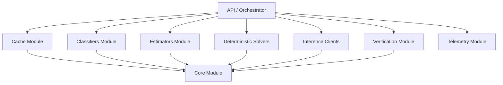
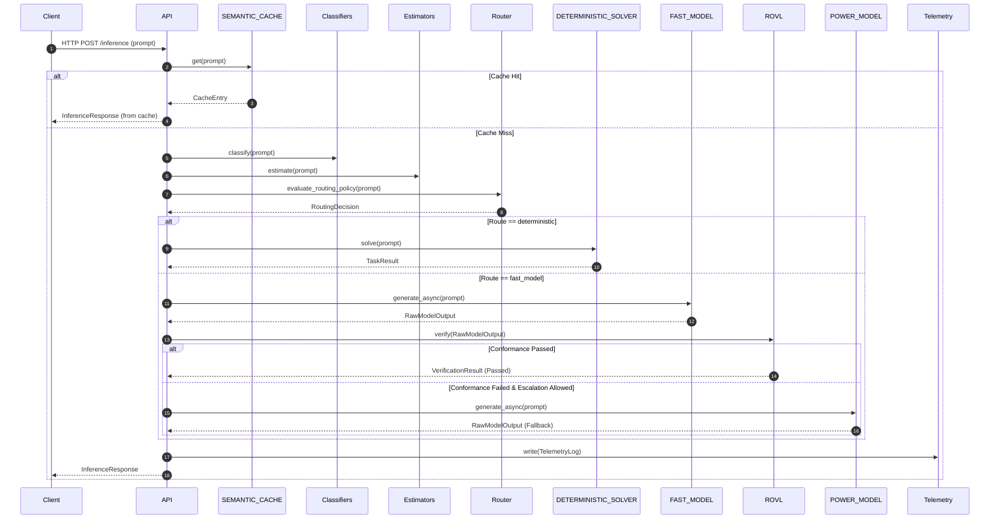
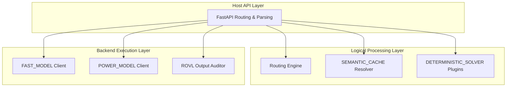

# TERA V3 Interface & Module Contract Specification

**Status:** Frozen  
**Version:** 3.2  

---

## 1. Purpose
This specification defines the strict logical and architectural boundaries of TERA V3. It serves as the authoritative, implementation-ready contract that developers and autonomous coding agents must follow. By specifying the public interfaces, dependency rules, data contracts, and error-handling behaviors, this document eliminates ambiguity and ensures that independent teams can develop, test, and integrate subsystems concurrently without contract violations.

---

## 2. Complete Repository Layout
The layout maps the physical file system hierarchy of the backend repository, ensuring clean boundaries.

```
backend/
├── app/
│   ├── __init__.py
│   ├── main.py                     # Application entrypoint
│   ├── api/                        # HTTP controllers, routers, schema models
│   │   ├── __init__.py
│   │   ├── routes.py
│   │   └── schemas.py
│   ├── cache/                      # SEMANTIC_CACHE implementations
│   │   ├── __init__.py
│   │   ├── cache_interface.py
│   │   ├── lmdb_cache.py
│   │   └── embedding_client.py
│   ├── classifiers/                # Prompt classifiers (intent, domain, language)
│   │   ├── __init__.py
│   │   ├── classifier_interface.py
│   │   └── prompt_classifier.py
│   ├── estimators/                 # Difficulty and computational cost estimators
│   │   ├── __init__.py
│   │   ├── estimator_interface.py
│   │   └── difficulty_estimator.py
│   ├── solvers/                    # DETERMINISTIC_SOLVER logic and plugins
│   │   ├── __init__.py
│   │   ├── solver_interface.py
│   │   └── plugins/
│   │       ├── arithmetic_solver.py
│   │       └── logic_solver.py
│   ├── inference/                  # LLM execution clients (FAST_MODEL, POWER_MODEL)
│   │   ├── __init__.py
│   │   ├── client_interface.py
│   │   ├── fast_model_client.py
│   │   └── power_model_client.py
│   ├── verification/               # ROVL validation and output verification
│   │   ├── __init__.py
│   │   ├── validator_interface.py
│   │   └── structural_validator.py
│   ├── telemetry/                  # Performance, routing tier, and cost telemetry
│   │   ├── __init__.py
│   │   ├── telemetry_interface.py
│   │   └── telemetry_writer.py
│   ├── core/                       # Core state, settings, orchestration, exceptions
│   │   ├── __init__.py
│   │   ├── config.py
│   │   ├── exceptions.py
│   │   ├── orchestrator.py
│   │   └── state.py
│   └── utils/                      # Common helpers (async context, string utils)
│       ├── __init__.py
│       └── helpers.py
│
├── tests/                          # 100% Mocked, deterministic test suites
│   ├── test_cache.py
│   ├── test_classifiers.py
│   ├── test_estimators.py
│   ├── test_solvers.py
│   ├── test_inference.py
│   ├── test_verification.py
│   └── test_telemetry.py
│
├── configs/                        # Environment config files (.env, settings.yaml)
│   ├── development.env
│   └── production.env
│
├── benchmarks/                     # Offline regression datasets & profiling scripts
│   ├── benchmark_data.csv
│   └── run_benchmark.py
│
├── docs/                           # Specifications and architecture docs
│   └── architecture/
│
├── scripts/                        # Database migrations & local environment setup
│   └── setup_env.sh
│
└── docker/                         # Multi-stage production deployment Dockerfiles
    ├── Dockerfile.backend
    └── Dockerfile.inference
```

---

## 3. Module Responsibilities

### 3.1 `api`
- **Purpose**: Exposes system functionality externally via HTTP.
- **Responsibilities**: Validates incoming HTTP payloads, coordinates execution flows (orchestrator pattern), maps internal contracts to API responses, handles HTTP-specific exception mapping.
- **Allowed Dependencies**: `cache`, `classifiers`, `estimators`, `solvers`, `inference`, `verification`, `telemetry`, `core`, `utils`.
- **Forbidden Dependencies**: Direct databases, raw socket connections.
- **Public Interface**: FastAPI router endpoint functions.
- **Expected Inputs**: `FastAPI Request` containing raw JSON.
- **Expected Outputs**: `FastAPI Response` returning status codes, final response string, and execution metadata.
- **Error Conditions**: Catches all inner exceptions and maps them to HTTP 400 (Client), HTTP 422 (Schema), or HTTP 500 (Server).

### 3.2 `cache`
- **Purpose**: Fast path query resolution using exact string matching and vector-similarity lookup via `SEMANTIC_CACHE`.
- **Responsibilities**: Performs local lookup/store operations, handles embedding generation for incoming prompts, prunes expired entries.
- **Allowed Dependencies**: `core`, `utils`.
- **Forbidden Dependencies**: `inference`, `solvers`, `verification`, `api`.
- **Public Interface**: `CacheInterface`.
- **Expected Inputs**: Raw prompt string.
- **Expected Outputs**: `Optional[CacheEntry]`.
- **Error Conditions**: Throws `CacheError` if database index is corrupted or unavailable.

### 3.3 `classifiers`
- **Purpose**: Categorizes domain, task, and semantic intent of prompts.
- **Responsibilities**: Evaluates classification models, outputs class names and probability vectors.
- **Allowed Dependencies**: `core`, `utils`.
- **Forbidden Dependencies**: `inference`, `solvers`, `verification`, `api`, `cache`.
- **Public Interface**: `ClassifierInterface`.
- **Expected Inputs**: Prompt string.
- **Expected Outputs**: `CategoryClassification`.
- **Error Conditions**: Throws `RoutingError` if model weights fail to load.

### 3.4 `estimators`
- **Purpose**: Predicts prompt solving difficulty and computational cost.
- **Responsibilities**: Computes character length, symbol ratio, regex density, and BM25 similarity features to output difficulty estimates (defined in Section 4.7).
- **Allowed Dependencies**: `core`, `utils`.
- **Forbidden Dependencies**: `inference`, `solvers`, `verification`, `api`, `cache`, `classifiers`.
- **Public Interface**: `DifficultyEstimatorInterface`.
- **Expected Inputs**: Prompt string.
- **Expected Outputs**: `DifficultyEstimate`.
- **Error Conditions**: Throws `RoutingError` on mathematical invalidity.

### 3.5 `solvers`
- **Purpose**: Executes rule-based and symbolic solver engines via `DETERMINISTIC_SOLVER`.
- **Responsibilities**: Parses logic/math expressions, safely executes code sandboxes, returns deterministic calculations.
- **Allowed Dependencies**: `core`, `utils`.
- **Forbidden Dependencies**: `inference`, `api`, `cache`, `classifiers`, `estimators`.
- **Public Interface**: `SolverInterface`.
- **Expected Inputs**: Prompt string and target solvers to invoke.
- **Expected Outputs**: `TaskResult`.
- **Error Conditions**: Throws `RoutingError` on unparseable structures, or sandboxing errors.

### 3.6 `inference`
- **Purpose**: Manages communication with underlying Large Language Models (`FAST_MODEL`, `POWER_MODEL`).
- **Responsibilities**: Dispatches async requests, handles network transient errors, parses raw output JSON, manages request timeouts.
- **Allowed Dependencies**: `core`, `utils`.
- **Forbidden Dependencies**: `solvers`, `api`, `cache`, `classifiers`, `estimators`.
- **Public Interface**: `InferenceClientInterface`.
- **Expected Inputs**: Prompt string, generation options.
- **Expected Outputs**: `RawModelOutput` (defined in Section 4.11).
- **Error Conditions**: Throws `InferenceTimeoutError` on timeout/network exhaustion; `ConfigurationError` on invalid authorization.

### 3.7 `verification`
- **Purpose**: Validates LLM outputs against strict patterns and entropy rules using `ROVL`.
- **Responsibilities**: Evaluates regex patterns, checks JSON schema conformance, calculates average surprisal values, and determines output token sequence entropy.
- **Allowed Dependencies**: `core`, `utils`.
- **Forbidden Dependencies**: `inference`, `solvers`, `api`, `cache`, `classifiers`, `estimators`.
- **Public Interface**: `ValidatorInterface`.
- **Expected Inputs**: `RawModelOutput` (defined in Section 4.11) and `VerificationConstraints` (defined in Section 4.5).
- **Expected Outputs**: `VerificationResult`.
- **Error Conditions**: Throws `VerificationError` on structural parser crashes.

### 3.8 `telemetry`
- **Purpose**: Persists operational metrics, cost, and routing decisions.
- **Responsibilities**: Asynchronously serializes telemetry logs, exports records to file systems or aggregators.
- **Allowed Dependencies**: `utils`.
- **Forbidden Dependencies**: `api`, `core`, `inference`, `cache`, `verification`.
- **Public Interface**: `TelemetryWriterInterface`.
- **Expected Inputs**: `TelemetryLog`.
- **Expected Outputs**: None.
- **Error Conditions**: Gracefully catches failures without crashing execution thread.

---

## 4. Core Data Contracts

### 4.1 `RoutingDecision`
- **Purpose**: Output of the routing policy model determining model selection.
- **Fields**:
  - `selected_tier`: `RouteSelection` (Enum: `deterministic`, `fast_model`, `power_model`)
  - `selected_execution_target`: `str` (Identifier of specific model or solver name)
  - `benchmark_category`: `str` (Associated classification category)
  - `difficulty`: `float` (Predicted prompt complexity score)
  - `routing_policy`: `str` (Selected active routing strategy)
  - `confidence`: `float` (Router's confidence score $[0.0, 1.0]$)
  - `escalation_allowed`: `bool` (Determines if routing to higher tier is permitted on failure)
  - `verification_required`: `bool` (Audit check indicator)
  - `expected_latency_ms`: `float` (Router estimated processing duration)
  - `expected_cost_tokens`: `int` (Router predicted generation token count)
  - `decision_reason`: `str` (Explanation for selected route selection)

### 4.2 `Task`
- **Purpose**: Request task payload.
- **Fields**:
  - `task_id`: `str` (UUIDv4 tracking ID)
  - `prompt`: `str` (Raw text query)
  - `timestamp`: `datetime` (UTC timestamp)

### 4.3 `TaskResult`
- **Purpose**: Output wrapper from deterministic solver execution.
- **Fields**:
  - `solved`: `bool` (True if solver solved the request)
  - `solution`: `Optional[str]` (Final output string if solved)
  - `execution_time_ms`: `float` (Time taken to execute)

### 4.4 `TelemetryLog`
- **Purpose**: Unified monitoring data structure for backend telemetry logging.
- **Fields**:
  - `timestamp`: `datetime` (UTC recording time)
  - `task_id`: `str` (UUID transaction correlation ID)
  - `routing_tier`: `str` (Selected route selection option)
  - `cache_hit`: `bool` (Indicates if exact/semantic cache was hit)
  - `solver_hit`: `bool` (Indicates if deterministic solver solved request)
  - `fast_model_tokens`: `int` (Total generated tokens on FAST_MODEL)
  - `power_model_tokens`: `int` (Total generated tokens on POWER_MODEL)
  - `validation_success`: `bool` (Output audit status)
  - `latency_ms`: `float` (Total transaction duration)

### 4.5 `VerificationConstraints`
- **Purpose**: Constraints configuration passed to the auditor.
- **Fields**:
  - `json_schema`: `Optional[Dict[str, Any]]` (JSON Schema validation constraint)
  - `regex_pattern`: `Optional[str]` (Regular expression validation constraint)
  - `stop_sequences`: `Optional[List[str]]` (Stop sequences to terminate generation)
  - `min_length_chars`: `Optional[int]` (Minimum output character length constraint)
  - `max_length_chars`: `Optional[int]` (Maximum output character length constraint)

### 4.6 `VerificationResult`
- **Purpose**: Output wrapper of the validator.
- **Fields**:
  - `passed`: `bool` (True if output satisfies all constraint checks)
  - `average_surprisal`: `float` (Calculated average token surprisal value)
  - `sequence_entropy`: `float` (Average output token sequence entropy)
  - `failed_validators`: `List[str]` (Identified failed validator components)

### 4.7 `DifficultyEstimate`
- **Purpose**: Prediction output from complexity analysis.
- **Fields**:
  - `difficulty_score`: `float` (Computed difficulty index)
  - `estimated_tokens`: `int` (Predicted length of completion)

### 4.8 `CategoryClassification`
- **Purpose**: Intent classification details.
- **Fields**:
  - `predicted_category`: `str` (Class label)
  - `confidence`: `float` (Class probability score)

### 4.9 `InferenceRequest`
- **Purpose**: Payload dispatched to LLM.
- **Fields**:
  - `prompt`: `str` (Payload body)
  - `temperature`: `float` (Sampling temperature)
  - `max_tokens`: `int` (Max generation budget)

### 4.10 `TokenLogprob`
- **Purpose**: The Pydantic model representation of a single generated token's log probability, defined in [data_contracts.py](backend/app/schemas/data_contracts.py).
- **Fields**:
  - `token`: `str` (The individual text characters corresponding to the token)
  - `logprob`: `float` (The log probability score calculated by the model for this token)

### 4.11 `RawModelOutput`
- **Purpose**: The canonical data contract containing raw generated token results.
- **Fields**:
  - `text`: `str` (Raw generated string output)
  - `tokens`: `List[TokenLogprob]` (Array of token details and log probability metrics, defined in Section 4.10; always present but may be empty if logprobs are unavailable)
  - `latency_ms`: `float` (Generation elapsed duration)
  - `usage_tokens`: `int` (Total token budget consumed)

### 4.12 `Configuration`
- **Purpose**: Immutable runtime settings.
- **Fields**:
  - `FAST_MODEL_ENDPOINT`: `str` (Serving base endpoint for fast path)
  - `FAST_MODEL_IDENTIFIER`: `str` (Model name/version for fast path)
  - `POWER_MODEL_ENDPOINT`: `str` (Serving base endpoint for power path)
  - `POWER_MODEL_IDENTIFIER`: `str` (Model name/version for power path)

### 4.13 `CacheEntry`
- **Purpose**: Cached payload record.
- **Fields**:
  - `prompt`: `str` (Key query text)
  - `response`: `str` (Cached output text)
  - `created_at`: `datetime` (UTC generation time)

---

## 5. Public Interfaces

### 5.1 `CacheInterface`
```python
class CacheInterface(ABC):
    @abstractmethod
    async def get(self, prompt: str) -> Optional[CacheEntry]:
        """Fetch cached response. Raises CacheError on DB fail."""
        pass

    @abstractmethod
    async def set(self, entry: CacheEntry) -> None:
        """Persist response. Thread-safe."""
        pass
```
- **Thread Safety**: Multiple async tasks must access the caching layer safely without locking issues. DB lock should be internal.

### 5.2 `ClassifierInterface`
```python
class ClassifierInterface(ABC):
    @abstractmethod
    def classify(self, prompt: str) -> CategoryClassification:
        """Classify prompt task type. Raises RoutingError if model is unloaded."""
        pass
```
- **Thread Safety**: Must allow concurrent read-only execution across threads. Model weights must remain immutable after initialization.

### 5.3 `DifficultyEstimatorInterface`
```python
class DifficultyEstimatorInterface(ABC):
    @abstractmethod
    def estimate(self, prompt: str) -> DifficultyEstimate:
        """Predict prompt computational difficulty."""
        pass
```
- **Thread Safety**: Fully thread-safe stateless calculations.

### 5.4 `RoutingPolicyInterface`
```python
class RoutingPolicyInterface(ABC):
    @abstractmethod
    def evaluate_routing_policy(self, prompt: str, context: Dict[str, Any]) -> RoutingDecision:
        """Evaluate the routing policy for a given prompt and context.
        
        Raises:
            RoutingError: If active policy configuration is invalid.
        """
        pass
```
- **Thread Safety**: Thread-safe model evaluator.

### 5.5 `InferenceClientInterface`
```python
class InferenceClientInterface(ABC):
    @abstractmethod
    async def generate_async(self, request: InferenceRequest) -> RawModelOutput:
        """Execute request. Raises InferenceTimeoutError."""
        pass
```
- **Thread Safety**: Reuses connection pools safely across concurrent async tasks.

### 5.6 `ValidatorInterface`
```python
class ValidatorInterface(ABC):
    @abstractmethod
    def verify(self, output: RawModelOutput, constraints: VerificationConstraints) -> VerificationResult:
        """Verify generated output. Raises VerificationError on parser error."""
        pass
```
- **Thread Safety**: Fully thread-safe stateless calculations.

### 5.7 `TelemetryWriterInterface`
```python
class TelemetryWriterInterface(ABC):
    @abstractmethod
    async def write(self, record: TelemetryLog) -> None:
        """Queue metrics to write asynchronously. Non-blocking."""
        pass
```
- **Thread Safety**: Thread-safe async task consumer queue.

### 5.8 `ConfigurationProviderInterface`
```python
class ConfigurationProviderInterface(ABC):
    @abstractmethod
    def get_config(self) -> Configuration:
        """Retrieve active configuration metadata."""
        pass
```
- **Thread Safety**: Returns frozen, immutable configuration instances.

---

## 6. Dependency Rules
Dependencies must only flow downwards from orchestrators to leaf modules. Circular imports are strictly forbidden.



---

## 7. Error Contract
Standardized application exceptions deriving from a single root class.

```
TERABaseException
├── ConfigurationError
├── InferenceTimeoutError
├── CacheError
├── VerificationError
└── RoutingError
```

### 7.1 `ConfigurationError`
- **Purpose**: System initialization errors.
- **When Raised**: Empty URL endpoints, negative max retries, missing secret API keys during load.
- **Recovery Strategy**: Fail fast at startup. Blocks application startup.

### 7.2 `InferenceTimeoutError`
- **Purpose**: SLA breach or network failure.
- **When Raised**: Server connection timeouts, socket hang-ups, retries exhaust.
- **Recovery Strategy**: Escalate connection path (e.g. route to fallback model).

### 7.3 `CacheError`
- **Purpose**: Cache availability failures.
- **When Raised**: File permission errors on local LMDB folder, corrupted index tables.
- **Recovery Strategy**: Log warning internally, bypass cache, and continue execution path (graceful degradation).

### 7.4 `VerificationError`
- **Purpose**: Structural audit failures.
- **When Raised**: Parser engines crash evaluating malformed response arrays.
- **Recovery Strategy**: Raise verification check failure flag, log trace, route request to fallback models.

### 7.5 `RoutingError`
- **Purpose**: Classification / Estimator model failures.
- **When Raised**: ONNX files fail to load from model directory, weights shape mismatch.
- **Recovery Strategy**: Fallback to hardcoded default route (e.g., direct route to POWER_MODEL).

---

## 8. Thread Safety Rules
1. **Immutable Objects**: Core contracts (`RoutingDecision`, `Task`, `RawModelOutput`, `TokenLogprob`) must be implemented as read-only dataclasses using Python's `@dataclass(frozen=True)` pattern.
2. **Mutable Objects**: Cache databases (LMDB) must leverage atomic read/write transactions. Lock sharing must reside inside the class boundary.
3. **Synchronization Rules**: Use `asyncio.Lock` when modifying in-memory state objects within async execution flows. Avoid blocking thread locks (`threading.Lock`) inside async code blocks.
4. **Async Boundaries**: CPU-bound tasks (ONNX inference, BM25 indexing) must run in `asyncio.get_event_loop().run_in_executor()` to prevent event loop blocking.

---

## 9. Logging Contract
All log events must serialize to single-line JSON records written to standard output (`sys.stdout`).

### 9.1 Required Log Fields
- `timestamp`: UTC ISO 8601 string (`YYYY-MM-DDTHH:MM:SS.mmmmmmZ`)
- `log_level`: Severity string (DEBUG, INFO, WARNING, ERROR, CRITICAL)
- `module`: Target module dot path (e.g. `app.inference.fast_model_client`)
- `message`: Informational text message
- `task_id`: UUIDv4 transaction correlation ID (nullable if system startup log)

### 9.2 Example JSON Log
```json
{"timestamp": "2026-07-12T12:45:01.002154Z", "log_level": "INFO", "module": "app.inference.fast_model_client", "message": "Inference completed", "task_id": "8b9e6f24-2c1b-4f9e-ad38-d6215b49ae63", "latency_ms": 125.4, "status_code": 200, "token_count": 42}
```

---

## 10. Telemetry Contract
Operational metrics must serialize cleanly to allow ingestion by standard monitoring stacks.

### 10.1 Telemetry Schema
- `timestamp`: String (UTC ISO 8601)
- `task_id`: String (UUIDv4)
- `routing_tier`: String (selected routing selection tier)
- `cache_hit`: Boolean (semantic cache status)
- `solver_hit`: Boolean (deterministic solver status)
- `fast_model_tokens`: Integer (sum of prompt and generated tokens on fast model)
- `power_model_tokens`: Integer (sum of prompt and generated tokens on power model)
- `validation_success`: Boolean (verification status)
- `latency_ms`: Float (end-to-end processing time)

### 10.2 JSON Serialization Example
```json
{
  "timestamp": "2026-07-12T12:45:01.005891Z",
  "task_id": "8b9e6f24-2c1b-4f9e-ad38-d6215b49ae63",
  "routing_tier": "fast_model",
  "cache_hit": false,
  "solver_hit": false,
  "fast_model_tokens": 182,
  "power_model_tokens": 0,
  "validation_success": true,
  "latency_ms": 320.12
}
```

---

## 11. Testing Requirements
1. **Unit Tests**: Coverage must be $\ge 90\%$ for all logical modules. Tests must target isolated functions.
2. **Deterministic Mocks**: Network calls, database files, and physical models must be fully mocked (e.g., using `unittest.mock.AsyncMock` or `pytest-mock`).
3. **Deterministic Seed**: Any random delay or backoff algorithm must accept a seed or be bypassed during mock execution to keep tests deterministic.

---

## 12. Coding Standards
1. **Python Version**: Minimum Python 3.11, target Python 3.13.
2. **Typing**: Strict type annotations on all parameters and return types. Verify with `mypy --strict`.
3. **Dataclasses**: Use `@dataclass(frozen=True)` for all transport schemas.
4. **Enums**: Group route options and solver modes in `Enum` collections.
5. **No Global State**: Do not instantiate singletons globally. Configuration settings must be injected into constructor endpoints using Dependency Injection.

---

## 13. Mermaid Diagrams

### 13.1 Request Lifecycle


### 13.2 Implementation Layering


---

## 14. Implementation Checklist

### 14.1 Modules Implementation Tracker
- [ ] `backend/app/api`
- [x] `backend/app/cache` (SEMANTIC_CACHE)
- [ ] `backend/app/classifiers`
- [ ] `backend/app/estimators`
- [ ] `backend/app/solvers` (DETERMINISTIC_SOLVER)
- [x] `backend/app/inference` (FAST_MODEL / POWER_MODEL)
- [x] `backend/app/verification` (ROVL Framework)
- [ ] `backend/app/telemetry`
- [x] `backend/app/core` (Orchestration & State Config)

---

## 15. Changelog
### Version 3.2
- Relocated files from legacy structures to match final project paths (`src/app` to `backend/app`, `config` to `core`, `validators` to `verification`, `deterministic` to `solvers`).
- Defined the canonical `RawModelOutput` data contract and updated interface dependencies to reference it.
- Realigned `VerificationConstraints` to the V3 contract (`json_schema`, `regex_pattern`, `stop_sequences`, `min_length_chars`, `max_length_chars`) and purged deprecated V2 properties.
- Realigned `VerificationResult` properties to match output audit schemas (`passed`, `average_surprisal`, `sequence_entropy`, `failed_validators`).
- Audited repository codebase and confirmed `TelemetryLog` is the single canonical source of truth for telemetry records; updated all specification names accordingly.
- Fixed residual `TelemetryRecord` parameter references inside Mermaid sequence diagrams to use `TelemetryLog`.
- Aligned `app/verification` responsibility wording with sequence entropy and token surprisal auditing metrics.
- Added definition details for the `TokenLogprob` sub-contract.
- Refined implementation checklist path headers to consistently utilize the `backend/app/*` pathing schema.

---

## 16. Revision Summary
1. **Repository Layout Refactoring**: Replaced all occurrences of legacy folder names (`src/app`, `config`, `validators`, `deterministic`) with the active backend project configuration path tree (`backend/app`, `core`, `verification`, `solvers`).
2. **Dataclass Modifications**:
   - Swapped out old check properties on `VerificationConstraints` (`schema_type`, `min_chars`, `max_chars`) for the strict V3 schema (`json_schema`, `regex_pattern`, `stop_sequences`, `min_length_chars`, `max_length_chars`).
   - Cleaned up output properties of `VerificationResult` (`entropy` and `failure_reason` removed; `average_surprisal`, `sequence_entropy`, and `failed_validators` integrated).
   - Added the explicit `RawModelOutput` data contract representing model outputs.
   - Added the explicit `TokenLogprob` details to Section 4.10.
3. **Telemetry Consistency**: Audited codebase models and changed all occurrences of the metric transport block from `TelemetryRecord` to the database schema name `TelemetryLog` (including within Section 13.1 request lifecycle sequence flow).
4. **Mermaid Diagram Updates**: Relabeled node references and diagram flows to use the correct `solvers`, `core`, `verification`, and `TelemetryLog` structures.
5. **Path Scheme Normalization**: Modified all folder names inside the implementation checklist (Section 14) to follow the canonical `backend/app/...` layout structure.
6. **Wording Realignment**: Adjusted module responsibility wording for `verification` (Section 3.7) to describe average surprisal and sequence entropy calculations instead of legacy generic token entropy definitions.

---

## 17. Final Self-Validation Summary
The following issues from the Final Freeze Review have been resolved:
- **Legacy Folders**: Every folder path reference is updated to point to `backend/app/*` (e.g. `backend/app/core`, `backend/app/verification`, `backend/app/solvers`). Verified that no `src/app` or `deterministic`/`validators`/`config` remains.
- **Verification Schemas**: `VerificationConstraints` and `VerificationResult` conform exactly to the V3 audit definitions.
- **RawModelOutput Contract**: Added in Section 4.11, matching the frozen code baseline exactly.
- **TokenLogprob Contract**: Added and defined in Section 4.10.
- **Telemetry Naming**: Confirmed that `TelemetryLog` is the correct codebase schema. All references to `TelemetryRecord` have been consistently replaced with `TelemetryLog` (including in the Mermaid diagrams).
- **References & Cross-references**: Every interface definition (`InferenceClientInterface` and `ValidatorInterface`) now maps correctly to the canonical `RawModelOutput`.
